## COGNIS

<p align="center"><strong>Keep thinking while you use AI.</strong></p>

<p align="center">
  
</p>

## The problem

AI gives you an answer fast, which is exactly what makes it easy to lean on. You type a vague prompt, get something plausible back, accept it, move on.

Do that often enough and the work of framing a problem (noticing what you actually want, which constraints matter, what you are assuming) shifts quietly from you to the model. The task still ships. But the skill stops developing, and you get worse at the part the model cannot do for you.

Cognis is a bet that the fix is not using AI less. It is making the moment before you hit send more deliberate.

## What it does

Cognis runs alongside ChatGPT, Claude, and Gemini.

**Before you send.** It notices when a prompt has no goal, no constraints, and no word about what you already tried. When you pause to think, it offers a short opener you finish in your own words.

**Over time.** It tracks which gaps you keep leaving and whether you start closing them unprompted. That lives in a side panel you open when you want it.

## Design principles

**Local first.** No server, no telemetry, no network calls anywhere in the source. Raw prompt text is never written to storage, only the derived signal: which gap, how confident.

**Never in the way.** Suggestions are picked from local templates during a natural pause. Nothing ever blocks you waiting on Cognis.

**Bounded memory.** Behavioural data expires after 90 days.

## Prompt enrichment

Worth understanding before you install. Cognis intercepts submit and prepends locally built context to your prompt before it reaches the model.

- The model sees more than you typed. Your own words are never altered or removed, but instructions you did not write are added around them.
- That added text is assembled from static local templates. Nothing is sent anywhere to produce it.
- The shipped templates are still placeholders and carry opinionated defaults, such as suppressing code blocks. Edit [`enrichment_layers.json`](src/core/config/enrichment_layers.json) to match how you actually work.

Implemented in [`SubmitInterceptor`](src/platforms/observers/SubmitInterceptor.ts) and [`EnrichmentEngine`](src/engines/enrichment/EnrichmentEngine.ts). Making it opt in is a priority.

## Install

Requires Node 20+ and a Chromium browser.

```bash
git clone https://github.com/prajein/cognis.git
cd cognis
npm install
npm run build
```

Then load it:

1. Open `chrome://extensions`
2. Enable **Developer mode**
3. Click **Load unpacked** and select the `dist/` folder

Open ChatGPT, Claude, or Gemini and start typing. Click the extension icon for the side panel.

## Development

```bash
npm run build      # build the extension
npm run test       # validate schemas and generated assets
npm run selftest   # run engine self-tests
```

Modules never call each other directly. They publish and consume domain events on a central bus:

```
        ChatGPT  ·  Claude  ·  Gemini
                     │
              DOM observers                  platforms/
                     │
                ┌────▼────┐
                │  event  │                  core/
                │   bus   │
                └────┬────┘
             ┌───────┼───────┐
            gap    ghost   insights          engines/
             └───────┼───────┘
                     │
                 IndexedDB                   storage/
                     │
                  side panel                 sidepanel/
```

Engines are pure logic with no DOM or storage access, which keeps them testable in isolation and makes supporting another AI platform a matter of writing an adapter rather than a new pipeline.

See [CONTRIBUTING.md](CONTRIBUTING.md) if you would like to help.

## Status

Early and under active development. Interfaces and behaviour will change.

Cognis modifies the page it runs on and reads what you type into it. It is a research prototype, not a hardened product. Read the source before trusting it with anything sensitive.

## License

MIT, see [LICENSE](LICENSE).
