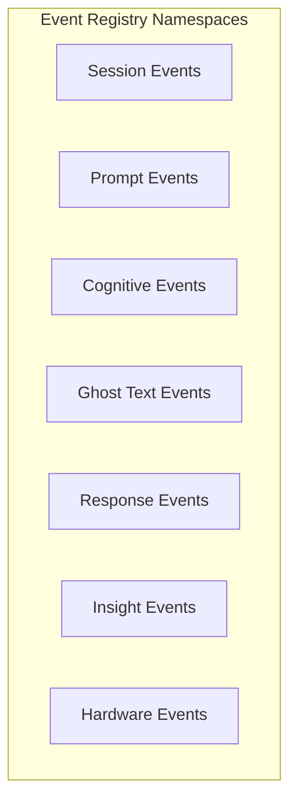

# Cognis Event Contracts: Implementation Overview

The Event Contracts layer establishes the unified, type-safe, and immutable messaging schema for the entire Cognis architecture. It serves as the single source of truth for all domain interactions, enabling full decoupling between the Perception Layer, Domain Engines, Storage Layer, and Presentation Layer.

---

## 1. Architectural Role & Design Philosophy

As mandated by the **Cognis Engineering Constitution**, all modules must communicate exclusively via Domain Events routed through the EventBus. Direct module-to-module invocations are strictly forbidden. 

To support this event-driven and event-sourced paradigm, the contract layer is designed with the following constraints:
* **JSON-Serializability**: All event shapes must be directly serializable to be persisted in IndexedDB.
* **Platform Agnosticism**: Contracts contain zero browser-specific, extension-specific, or platform-specific types (e.g., no Chrome tab objects, raw DOM events, or platform-specific UI handles).
* **Hardware Readiness**: Event schemas for cognitive states and hardware signals are frozen and fully compatible with future physical Arc devices.

---

## 2. Strong Type System & Branded Types

Cognis implements strict type boundaries using branded types to prevent bugs arising from assigning generic string or number primitives. Defined in [session.types.ts](file:///Users/ntbnaren7/Dev/cognis/src/core/types/session.types.ts), these types require the use of explicit constructor functions.

### Branded Type Architecture
```typescript
declare const __sessionIdBrand: unique symbol;
declare const __eventIdBrand: unique symbol;
declare const __timestampBrand: unique symbol;

export type SessionId = string & { readonly __brand: typeof __sessionIdBrand };
export type EventId = string & { readonly __brand: typeof __eventIdBrand };
export type Timestamp = number & { readonly __brand: typeof __timestampBrand };
```

### Brand Constructors
* `toSessionId(id: string): SessionId`
* `toEventId(id: string): EventId`
* `toTimestamp(ms: number): Timestamp`

By enforcing unique symbols for branding, the compiler prevents accidental code like:
```typescript
const session: SessionId = "sess_12345"; // Compile-time Error
```
Developers must explicitly use:
```typescript
const session: SessionId = toSessionId("sess_12345"); // Compiles successfully
```

---

## 3. Universal Domain Event Envelope

Every event routed through the EventBus or stored within the IndexedDB Event Store is wrapped in a standard `DomainEvent` envelope. This generic envelope is defined in [contracts.ts](file:///Users/ntbnaren7/Dev/cognis/src/core/event-bus/contracts.ts):

```typescript
export interface DomainEvent<T> {
  readonly id: EventId;
  readonly type: EventType;
  readonly timestamp: Timestamp;
  readonly sessionId: SessionId;
  readonly source: string;
  readonly payload: T;
}
```

### Envelope Fields Reference
| Field | Type | Description |
| :--- | :--- | :--- |
| `id` | `EventId` | Globally unique identifier generated per event instance. Used for deduplication. |
| `type` | `EventType` | A string identifier representing the event class, derived from the Event Registry. |
| `timestamp` | `Timestamp` | Millisecond Unix epoch timestamp recording when the event was generated. |
| `sessionId` | `SessionId` | Relates the event to a specific, continuous user interaction tab/session. |
| `source` | `string` | The identifier of the specific provider or engine that generated the event. |
| `payload` | `T` | The specific, read-only payload object matching the event type contract. |

---

## 4. The Event Registry

The Event Registry in [registry.ts](file:///Users/ntbnaren7/Dev/cognis/src/core/event-bus/registry.ts) defines 23 distinct domain events. All event namespaces are frozen at runtime using `Object.freeze` to prevent runtime mutation.



### Event Reference Catalog

| Namespace | Event Name | Payload Type | Core Purpose / Producer |
| :--- | :--- | :--- | :--- |
| **Session** | `session.started` | `SessionStartedPayload` | Initiated when a tab on a supported AI platform is opened/loaded. |
| | `session.ended` | `SessionEndedPayload` | Dispatched when a session is closed (tab close, navigation, or timeout). |
| | `session.paused` | `SessionPausedPayload` | Dispatched when the user switches tabs or becomes idle. |
| | `session.resumed` | `SessionResumedPayload` | Dispatched when resuming a paused session. |
| **Prompt** | `prompt.typed` | `PromptTypedPayload` | High-frequency character counts, word counts, and hashes of the user's input. |
| | `prompt.sent` | `PromptSentPayload` | Captures final text metrics and whether enrichment was applied upon submission. |
| | `prompt.enriched` | `PromptEnrichedPayload` | Records enrichment metadata applied by the Enrichment Engine. |
| | `prompt.cancelled` | `PromptCancelledPayload` | Captures prompt hash and size metrics when a user clears/abandons typing. |
| **Cognitive** | `pause.detected` | `PauseDetectedPayload` | Fired when a typing pause exceeds the cognitive latency threshold. |
| | `state.changed` | `StateChangedPayload` | Inferred cognitive load transitions (`stretch`, `coasting`, `overload`). |
| | `gap.detected` | `GapDetectedPayload` | Specific cognitive gap identified in the user's prompt (e.g. stakes, mechanism). |
| **Ghost Text** | `ghosttext.generated` | `GhostTextGeneratedPayload` | Injected suggestion text formulated to resolve a cognitive gap. |
| | `ghosttext.displayed` | `GhostTextDisplayedPayload` | Tracks when a ghost text suggestion is actively shown in the DOM. |
| | `ghosttext.accepted` | `GhostTextAcceptedPayload` | Fired when a user presses Tab to accept a ghost text suggestion. |
| | `ghosttext.dismissed` | `GhostTextDismissedPayload` | Dispatched when a suggestion is ignored, timed out, or typing resumes. |
| **Response** | `response.started` | `ResponseStartedPayload` | Dispatched when the target AI platform begins streaming a completion. |
| | `response.chunk` | `ResponseChunkPayload` | Tracks incremental character size metrics of the streaming response. |
| | `response.completed` | `ResponseCompletedPayload` | Records the final response size and execution time of the completion. |
| | `response.abandoned` | `ResponseAbandonedPayload` | Fired if the user stops the response stream or closes the platform tab. |
| **Insight** | `insight.generated` | `InsightGeneratedPayload` | Summary behavioral analysis generated asynchronously for Surface B. |
| | `milestone.reached` | `MilestoneReachedPayload` | Tracks mastery milestones reached for a given skill domain. |
| | `automaticity.updated` | `AutomaticityUpdatedPayload` | Updates the longitudinal automaticity phase and numeric score. |
| **Hardware** | `hardware.connected` | `HardwareConnectedPayload` | Fired when external physical Arc hardware connects via BLE. |
| | `hardware.disconnected` | `HardwareDisconnectedPayload` | Fired when physical Arc hardware disconnects. |
| | `hardware.signal.received` | `HardwareSignalReceivedPayload` | Bridges biometric/physical metrics from Arc hardware to the State Engine. |

---

## 5. Compile-Time Type Mapping via `CognisEventMap`

To enforce strict, runtime-safe event dispatch without requiring explicit casting, the system maps event type keys directly to their payload structures in `CognisEventMap` within [contracts.ts](file:///Users/ntbnaren7/Dev/cognis/src/core/event-bus/contracts.ts).

### Usage and Inference Example
When registering a subscriber or publishing an event, the compiler enforces typing based on the string key:

```typescript
// Subscribing to an event:
eventBus.subscribe('state.changed', (event) => {
  // 'event' is automatically typed as DomainEvent<StateChangedPayload>
  const current = event.payload.currentState; // typed as 'stretch' | 'coasting' | 'overload'
});

// Publishing an event:
eventBus.publish('session.started', {
  id: toEventId('evt_123'),
  type: 'session.started',
  timestamp: toTimestamp(Date.now()),
  sessionId: toSessionId('sess_456'),
  source: 'content-script',
  payload: {
    platform: 'chatgpt' // Type-checked against SessionStartedPayload
  }
});
```

---

## 6. Implementation References

* **Registry Definition**: [registry.ts](file:///Users/ntbnaren7/Dev/cognis/src/core/event-bus/registry.ts) – Holds namespaces, event constants, and the derived `EventType` union.
* **Payload Interfaces & Event Map**: [contracts.ts](file:///Users/ntbnaren7/Dev/cognis/src/core/event-bus/contracts.ts) – Contains all event schemas and the `CognisEventMap`.
* **Standard Branded Identifiers**: [session.types.ts](file:///Users/ntbnaren7/Dev/cognis/src/core/types/session.types.ts) – Enforces branded type primitives for identifiers.
* **Domain taxonomies**:
  * [state.types.ts](file:///Users/ntbnaren7/Dev/cognis/src/core/types/state.types.ts) – Cognitive state definitions.
  * [gap.types.ts](file:///Users/ntbnaren7/Dev/cognis/src/core/types/gap.types.ts) – Cognitive gap taxonomy.
  * [platform.types.ts](file:///Users/ntbnaren7/Dev/cognis/src/core/types/platform.types.ts) – Supported platforms.
