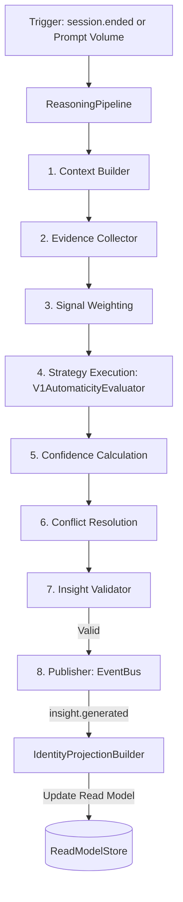

# Week 3: Insight Engine Implementation Overview

## 1. Executive Summary

The **Insight Engine** is the apex reasoning layer of the Cognis platform. Operating out-of-band in the background service worker context, it isolates heavy inferential compute from the user's synchronous event loop.

Unlike other reactive engines, the Insight Engine synthesizes longitudinal state over time. It queries historical events from the Projection DB (Read Models), executes behavioral evaluation strategies, and emits `insight.generated` events that update the user's permanent cognitive identity model.

---

## 2. Technical Architecture & 8-Stage Pipeline

### The 8-Stage Reasoning Loop
1. **Context Builder**: Establishes the session temporal boundary.
2. **Evidence Collector**: Extracts raw events and metrics from read models.
3. **Signal Weighting**: Multiplies evidence by recency decay factors.
4. **Strategy Execution**: Dispatches modular logic engines (e.g., `InsightStrategy`).
5. **Confidence Calculation**: Grades candidates using a mathematical density model.
6. **Conflict Resolution**: Applies penalty metrics for contradictions against existing identity.
7. **Insight Validator**: Evaluates candidates against strict validation gates (Confidence >= 0.75, Evidence Count >= 5).
8. **Publisher**: Emits the structured `insight.generated` fact to the EventBus.

---

## 3. Key Components & Implementation Details

- **ConfidenceCalculator**: Formulates decay over time. Events within 30 days are weighted at 100%, 30–90 days at 50%, and older than 90 days at 10%. Contradictory insights suffer a 40% confidence penalty unless evidence volume is doubled.
- **InsightValidator**: Assures high-fidelity, high-confidence insights only.
- **V1AutomaticityEvaluator**: Heuristically models skill mastery transitions (Cognitive -> Associative -> Autonomous) based on error rates and successful completion patterns.
- **InsightScheduler**: Runs on a pull-based strategy to prevent background CPU cycles from starving other processes. Triggers exclusively on `session.ended` or upon reaching a `PROMPT_VOLUME_THRESHOLD` (e.g., 100 prompts).

---

## 4. Projections & Read Models

The Insight Engine completes the CQRS loop:
1. It queries read models to obtain structured event metrics.
2. It processes and writes a new domain event (`insight.generated`).
3. The `IdentityProjectionBuilder` intercepts the event and updates the final `identity-v1` Read Model, projecting user characteristics to the UI presentation layer.
