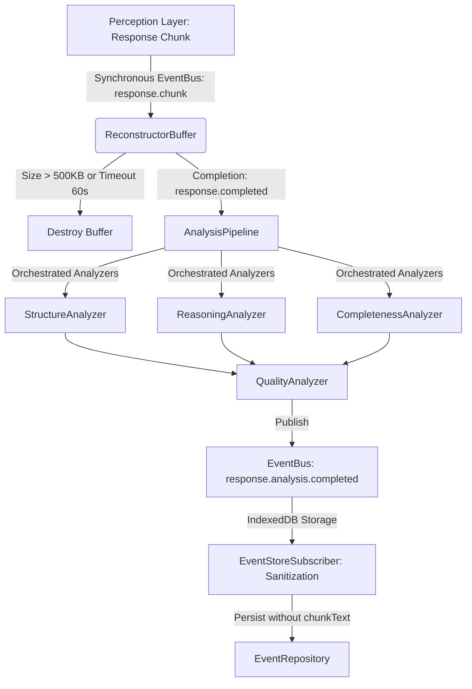

# Week 3: Response Intelligence Engine Implementation Overview

## 1. Executive Summary

The **Response Intelligence Engine** represents Cognis' analytical capability to observe, reconstruct, and comprehend the outputs generated by AI platforms (e.g., ChatGPT). Unlike the Enrichment Engine, which modifies outgoing prompts, this engine acts purely as an observer on incoming data streams. 

Crucially, **this engine does not generate insights.** Its sole responsibility is to analyze a *single* response in isolation, evaluate it across multiple dimensions (structure, reasoning, completeness, and quality), and emit a standardized, deterministic metric event (`response.analysis.completed`). These events are later synthesized longitudinally by the Insight Engine.

---

## 2. Technical Architecture & Component Flow

### Component Breakdown
1. **ReconstructorBuffer**: Combines streaming `ResponseChunkPayload` texts under strict memory boundaries (maximum 500KB) and watchdogs (60-second inactivity).
2. **AnalysisPipeline**: Orchestrates the analyzers and builds the final metrics payload.
3. **Deterministic Analyzers**:
   - `StructureAnalyzer`: Grades MD structural formatting and density.
   - `ReasoningAnalyzer`: Grades reasoning transitions (e.g., "therefore", "because") and branching conditions (e.g., "if", "however").
   - `CompletenessAnalyzer`: Verifies unclosed tags and structural completions.
   - `QualityAnalyzer`: Outputs a composite score and flags.

---

## 3. Transient Transport Data Policy (ADR-019)

To comply with the zero-persistence guidelines of the Cognis Constitution, the streaming response texts are handled as transient data:
* `chunkText` is added to the EventBus payload strictly as `[TRANSPORT-ONLY]`.
* It exists in-memory during dispatch.
* The `EventStoreSubscriber` creates a sanitized clone of the event and deletes `chunkText` before appending to IndexedDB, ensuring zero persistence of raw AI output text.
* The in-memory buffer is explicitly dereferenced and garbage collected immediately after analysis.

---

## 4. CQRS Compliance

The Response Intelligence Engine strictly adheres to CQRS boundaries. It registers commands/events (e.g., `response.chunk`, `response.completed`) from the perception layer and issues facts (e.g., `response.analysis.completed`). It performs no state updates, read-model operations, or repository queries.
