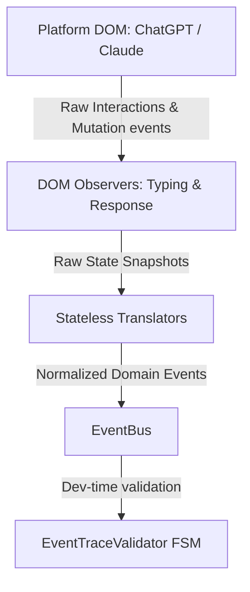

# Implementation Overview: Runtime Perception Layer

## Overview
This document provides a comprehensive overview of the design, implementation, and hardening of the **Runtime Perception Layer**. Operating at the boundary between the browser DOM and the local-first application architecture, this layer is responsible for observing user inputs, parsing text streaming mutations, translating DOM-level observations into structured domain events, and publishing them to the central `EventBus`.

As the entry point for the CQRS pipeline, ensuring absolute correctness, memory safety, and performance within the perception layer is vital to prevent corrupt event streams from poisoning downstream state projections and insight generators.

---

## Architectural Topology
The Runtime Perception Layer represents a strictly decoupled translation pipeline:



---

## 1. Domain Observers (`src/platforms/observers/`)

The observers are stateful components that bind directly to platform-specific DOM nodes defined by a registry of selector configurations. 

### A. TypingObserver
The `TypingObserver` tracks user inputs, distinguishing between active writing, pauses, and intent-to-submit gestures.

* **Input Sniffing**: Attaches to the platform's input textarea, capturing composition events (`compositionstart`, `compositionend`), keystrokes (`keydown`), and input events.
* **Submission Detection**: Identifies potential prompt submissions by monitoring `Enter` key presses (filtering out `Shift+Enter` multi-line breaks) and clicks on platform-specific submit buttons.
* **Typing Cadence Calculation**: Tracks the length of text, word count, text revision depth, and captures typing pauses to allow downstream models to evaluate automaticity.

### B. ResponseObserver
The `ResponseObserver` tracks real-time assistant responses.

* **Response Container Detection**: Discovers the active output node within the conversation stream using dynamic query selectors.
* **Cursor-Based Delta Generation**: Rather than tracking raw output length (which changes unpredictably during markdown table formatting, syntax highlighting updates, or React-based DOM node recycling), it maintains a logical `ResponseCursor` indicating the last processed text snapshot. 
* **Render-Loop Decoupling**: Offloads DOM reading from synchronous mutation callbacks to a paint-aligned loop.

---

## 2. Stateless Translation Boundaries (`src/platforms/translators/`)

To prevent platform-specific details (like CSS selectors, HTML layout changes, or browser-specific mutation events) from leaking into the core application state, we implemented a strict boundary of stateless translators.

* **`TypingTranslator`**: Accepts raw `TypingSnapshot` structures and produces normalized domain events like `prompt.typed` and `cognitive.pause_detected`.
* **`ResponseTranslator`**: Accepts raw `ResponseSnapshot` structs (which describe whether a response is starting, completed, or in progress along with the current text chunk) and translates them into normalized events like `response.started`, `response.chunk`, and `response.completed`.

This design decouples the event bus from the visual interface, allowing platform selectors to be updated without breaking downstream business logic.

---

## 3. Evolutionary Milestones (Before vs. After)

### Milestone A: DOM Event Binding & Memory Safety
* **Before**: Observers managed event listeners through manual callback tracking. Disconnection required matching listener signatures precisely, which risked leaving active "zombie" listeners behind if an observer was destroyed during platform tab transitions or React-driven DOM updates.
* **After**: Standardized lifecycle management around the browser-native `AbortController`. An observer instantiates a single controller on connection and passes its `AbortSignal` to every `addEventListener` call. Calling `disconnect()` invokes `abortController.abort()`, cleanly stripping all listeners. Furthermore, `Node.isConnected` checks are executed during loop cycles to automatically teardown observers if a target DOM element is detached.

### Milestone B: Duplicate Submission Suppression
* **Before**: The system attempted to prevent multiple submissions (e.g. key press and click triggering back-to-back) by verifying if the DOM input field was empty (`input.value === ""`). This was fragile, as different platforms clear their inputs at varying rates, causing duplicate `prompt.sent` events that corrupted state.
* **After**: Transitioned to a state-driven machine inside `TypingObserver` tracking a `submissionState` (`Idle` | `SubmissionPending`).
  ```
  Idle ──(Enter or Click Submit)──> Emit prompt.sent & enter SubmissionPending
  SubmissionPending ──(ResponseStarted / Abandoned / SessionEnded)──> Idle
  ```
  During the `SubmissionPending` state, subsequent submission attempts are suppressed.
* **Domain Constraint**: The canonical runtime lifecycle currently has no terminal event representing a failed prompt submission (e.g., a network failure before `response.started`). Until a future `prompt.submit_failed` domain event is introduced, the `SubmissionPending` state can only be cleared by `response.started`, `response.abandoned`, or `session.ended`. This is an intentional constraint of the current domain event model, not of the observer implementation itself.

### Milestone C: Main-Thread Render Performance
* **Before**: `ResponseObserver` read and computed text deltas directly inside high-frequency `MutationObserver` callbacks. When the model streamed tokens quickly, the main thread became blocked by DOM queries, causing layout thrashing and UI lag.
* **After**: Decoupled DOM mutations from delta calculations. The `MutationObserver` now acts as an interrupt, flipping a `dirty` flag. A decoupled loop bound to the browser's `requestAnimationFrame` checks this flag, reads the DOM, and calculates differences exactly once per frame (60Hz), matching rendering rates and saving CPU cycles.

### Milestone D: Event Integrity Verification
* **Before**: The system was vulnerable to invalid event sequences (e.g. receiving a `response.chunk` prior to `response.started`), which could crash downstream state stores and diagnostic builders.
* **After**: Integrated the `EventTraceValidator` into the dev-time event stream. It monitors the `EventBus` and validates transitions against a formal 6-state canonical lifecycle FSM. Any invalid sequence (such as multiple concurrent sessions or out-of-order generation events) triggers a warning to prevent corrupt states from propagating.

---

## 4. Verification & Testing Strategy

Correctness is validated through two distinct test files:

1. **Stateless Translator Tests** (`src/tests/platforms/translators.selftest.ts`):
   Validates that raw snapshots are properly transformed into correct event structures, confirming text ranges, session IDs, and payload parameters match specifications.

2. **Integration Hardening Tests** (`src/tests/platforms/hardening.selftest.ts`):
   Fires structured events against a mock DOM environment to verify:
   * Valid transition lifecycle validation.
   * Rejection and reporting of invalid transitions (e.g., `SessionStarted -> response.chunk` and `Streaming -> prompt.sent`).
   * Suppression of duplicate prompt submissions.
   * Resetting of the submission state upon lifecycle events.

All negative assertions in the test suite are captured and logged with assertion-style reports to prevent cluttering the output with expected errors.

---

## Conclusion
The Runtime Perception Layer is functionally complete and verified against the current architecture RFC. Production readiness remains contingent on end-to-end validation against supported platforms (ChatGPT/Claude) under real browser conditions.
