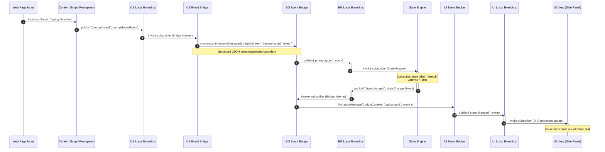

# Cognis EventBus Implementation Plan

## 1. Executive Summary & Design Goals
The EventBus is the central nervous system of Cognis, acting as the decoupled backbone that coordinates communication between perception providers, domain engines, storage systems, and user interface panels. This document serves as the implementation plan and blueprint for the `EventBus` class and its cross-context routing extension.

### Design Goals & Constraints
*   **Decoupling**: Modules communicate exclusively through Domain Events. No module may directly invoke methods inside another module (Engineering Constitution Section 2).
*   **Synchronous Dispatch (In-Process)**: Events within the same Javascript runtime context are routed synchronously.
*   **Multi-Context Bridging**: Seamlessly routes events across isolated browser extension processes (Content Script $\leftrightarrow$ Background Worker $\leftrightarrow$ Side Panel/Popup).
*   **Strict Latency Budget**: Event dispatch execution latency must remain under **5 ms** (Engineering Constitution Section 2).
*   **Compile-Time Type Safety**: Full type inference on subscription callback payloads and publication payloads, derived from `CognisEventMap` and `EventType`.
*   **No State / Logic**: The EventBus carries out routing and dispatch only. It has no persistent storage, no business logic, and no decision-making capabilities.

---

## 2. Architecture & Topologies
Cognis runs in a multi-context environment (Layer 1 - Platform Runtime). To bridge isolation barriers, the event routing topology consists of two distinct components:

1.  **Process-Local EventBus**: A class instance implementing `EventBusContract` running inside each active context (Content Script, Background Service Worker, Side Panel, etc.). This manages synchronous, local subscriptions and dispatch.
2.  **Extension Event Bridge**: An adapter that monitors local events and forwards them across runtime boundaries using browser extension APIs (`chrome.runtime.sendMessage`, `chrome.runtime.connect`, and `chrome.tabs.sendMessage`).

### System Topology Diagram

```mermaid
graph TD
    subgraph "Perception Context (Content Script)"
        CS_Perceptor["Perception Layer Providers<br>(e.g. typing state, pause detector)"]
        CS_Bus["Local EventBus<br>(In-Process)"]
        CS_Bridge["Extension Event Bridge"]
    end

    subgraph "Background Context (Service Worker)"
        BG_Bridge["Extension Event Bridge"]
        BG_Bus["Local EventBus<br>(In-Process)"]
        BG_Engines["Domain Engines<br>(State, Gap, GhostText, Enrichment)"]
        BG_Storage["Storage Layer<br>(IndexedDB Event Store)"]
    end

    subgraph "UI Context (Side Panel / Popup)"
        UI_Bridge["Extension Event Bridge"]
        UI_Bus["Local EventBus<br>(In-Process)"]
        UI_Views["Presentation Views<br>(Projections, Charts, Task List)"]
    end

    %% Web DOM Events to Perception
    DOM["Web Page DOM Keyboard/Mouse Inputs"] -->|Native DOM Events| CS_Perceptor

    %% Local pub/sub in Content Script
    CS_Perceptor -->|localEventBus.publish| CS_Bus
    CS_Bus -.->|dispatch| CS_Bridge

    %% IPC Bridge between Content Script and Background
    CS_Bridge <==>|Chrome Extension IPC<br>(Serialization)| BG_Bridge

    %% Local pub/sub in Background
    BG_Bridge -->|localEventBus.publish| BG_Bus
    BG_Bus -.->|dispatch| BG_Engines
    BG_Bus -.->|dispatch| BG_Storage
    BG_Engines -->|localEventBus.publish| BG_Bus

    %% IPC Bridge between Background and UI
    BG_Bridge <==>|Chrome Extension IPC| UI_Bridge

    %% Local pub/sub in UI
    UI_Bridge -->|localEventBus.publish| UI_Bus
    UI_Bus -.->|dispatch| UI_Views
```

---

## 3. Boundaries & Responsibilities

| Responsibility | Inside EventBus Boundary | Outside EventBus Boundary (Other Layers) |
| :--- | :--- | :--- |
| **Registration** | Storing callbacks per event type in an efficient memory structure. | Declaring event structures or typing (`src/core/event-bus/contracts.ts`). |
| **Dispatch** | Synchronously iterating over registered callbacks for a specific event type. | Determining when an event should be sent (Perception Layer / Engines). |
| **Error Handling** | Catching callback execution errors to isolate failures. | Recovering from or handling domain exceptions (handled by specific Engines). |
| **Persistence** | None. | Persisting events to IndexedDB (`src/storage/EventStore.ts`). |
| **Cross-Context Routing**| Local instance does not know about IPC. | `ExtensionEventBridge` coordinates message serialization and forwarding. |
| **Replay & Sourcing** | Dispatching historical events as they are fed in. | Retrieving historical events from storage and coordinating re-application. |

---

## 4. API Specifications & Typing

The implementation will fulfill the interfaces declared in [types.ts](file:///Users/ntbnaren7/Dev/cognis/src/core/event-bus/types.ts).

### The EventBus Interface

```typescript
export interface EventBusContract {
  publish<T extends EventType>(
    type: T,
    event: DomainEvent<CognisEventMap[T]>,
  ): void;

  subscribe<T extends EventType>(
    type: T,
    handler: EventHandler<T>,
  ): () => void;
}
```

### Usage Examples

#### 1. Publishing an Event (e.g., in Perception Layer)
```typescript
import { EventBus } from './EventBus';
import { PromptEvents } from './registry';
import { toEventId, toSessionId, toTimestamp } from '../types/session.types';

const eventBus = new EventBus();

// Type inference validates that payload matches PromptTypedPayload
eventBus.publish(PromptEvents.TYPED, {
  id: toEventId('evt_12345'),
  type: PromptEvents.TYPED,
  timestamp: toTimestamp(Date.now()),
  sessionId: toSessionId('sess_98765'),
  source: 'keyboard-listener',
  payload: {
    textLength: 42,
    wordCount: 8,
    currentTextHash: 'sha256-abcdef123...',
    revisionDepth: 1,
  },
});
```

#### 2. Subscribing to an Event (e.g., in State Engine)
```typescript
import { EventBus } from './EventBus';
import { CognitiveEvents } from './registry';

const eventBus = new EventBus();

const unsubscribe = eventBus.subscribe(CognitiveEvents.STATE_CHANGED, (event) => {
  // TypeScript strictly types payload as StateChangedPayload
  const stateLabel = event.payload.stateLabel; // 'stretch' | 'coasting' | 'overload'
  console.log(`Cognitive state changed: ${stateLabel}`);
});

// To clean up/remove subscription
unsubscribe();
```

---

## 5. Detailed Design & IPC Bridge

### Class: `EventBus` (In-Process Broker)
*   **Storage Structure**: Handlers are stored in a `Map<EventType, Set<EventHandler<any>>>`.
    *   Using a `Set` ensures duplicate subscriber registration is ignored and removal is an $O(1)$ operation.
*   **Synchronous Dispatch**:
    ```typescript
    publish<T extends EventType>(type: T, event: DomainEvent<CognisEventMap[T]>): void {
      const handlers = this.handlers.get(type);
      if (!handlers || handlers.size === 0) return;

      for (const handler of handlers) {
        try {
          handler(event);
        } catch (error) {
          console.error(`[EventBus] Error in subscriber for ${type}:`, error);
        }
      }
    }
    ```
*   **Unsubscribe and Memory Leak Prevention**:
    The returned unsubscribe function must clean up the handler, deleting the `Set` entry if it is empty to prevent memory overhead:
    ```typescript
    subscribe<T extends EventType>(type: T, handler: EventHandler<T>): () => void {
      if (!this.handlers.has(type)) {
        this.handlers.set(type, new Set());
      }
      const set = this.handlers.get(type)!;
      set.add(handler);

      return () => {
        set.delete(handler);
        if (set.size === 0) {
          this.handlers.delete(type);
        }
      };
    }
    ```

### Class: `ExtensionEventBridge` (Cross-Context Router)
To allow a Content Script to send events (like `prompt.typed`) to the Background worker and Side Panel, the Bridge uses standard browser messaging:

1.  **Transport Mechanisms**:
    *   **Port-based (Long-Lived Connections)**: Recommended for the Side Panel $\leftrightarrow$ Background communication, using `chrome.runtime.connect`. Provides high throughput, zero connection setup overhead, and simple lifecycle management.
    *   **Message-based (Short-Lived IPC)**: Content Script $\leftrightarrow$ Background communication via `chrome.runtime.sendMessage` / `chrome.tabs.sendMessage`.
2.  **Routing / Loop Prevention**:
    *   When an event is bridged, it retains its original `source` field.
    *   The bridge maintains a unique routing source name (e.g. `bridge-content-script`).
    *   To prevent event echoing (infinite forwarding loops), the bridge must not forward an event back to the context from which it originated.
    *   Alternatively, the message payload structure wrapped by IPC includes metadata about the origin:
        ```typescript
        interface BridgeEnvelope {
          originContext: 'content-script' | 'background' | 'side-panel';
          event: DomainEvent<any>;
        }
        ```
    *   If `originContext` matches the current environment, the bridge ignores it.

---

## 6. Sequence Diagram: Event Lifecycle

Below is the execution flow of a user typing a prompt, triggering state calculations, and updating the UI:



---

## 7. Failure Modes & Resilience

| Failure Mode | Impact | Mitigation Strategy |
| :--- | :--- | :--- |
| **Subscriber Exception** | Could interrupt execution flow, crashing subsequent event dispatch. | Each call inside the dispatch loop is wrapped in a `try/catch` block. The EventBus reports the error to console/telemetry and continues with the next handler. |
| **Infinite Recursion Loop**| Stack overflow. Occurs if Event A triggers Event B, which in turn triggers Event A. | Implement loop detection inside `publish`. Maintain a thread-local execution depth count or list of active event dispatches. If depth exceeds a threshold (e.g., 10), drop the event and throw a warning. |
| **IPC Serialization Failures** | Message cannot be sent across context boundaries. | Enforce JSON serializability of all payloads at compile time. Use typescript-enforced records of primitive types, arrays, and branded types (which serialize cleanly as string/number). |
| **Extension Context Invalidated** | Chrome background service worker restarts or side panel is closed. | Connections between side panel ports and background worker must support auto-reconnection. Port callbacks must gracefully handle disconnection states. |
| **Slow Consumer (INP/Latency Block)** | A heavy subscriber takes > 10ms, violating the dispatch latency budget. | Subscribers are forbidden from running blocking synchronous logic. Heavy operations (e.g. database writing, AI analysis, prompt hashing) must be executed asynchronously (`Promise`, `setTimeout`, or `requestIdleCallback`) to yield control immediately. |

---

## 8. Testing Strategy

### 8.1 Unit Tests (Synchronous Local EventBus)
*   **Verification of Pub/Sub**: Verify that calling `publish` successfully routes the event payload to a subscriber callback.
*   **Unsubscription Cleanup**: Verify that calling the returned unsubscribe function removes the subscriber and deletes the handler set to prevent memory leaks.
*   **Handler Isolation**: Register multiple subscribers. Make one throw an error. Verify that other subscribers still execute successfully.
*   **Compile-Time Type Verification**: Write typescript assertion tests verifying that invoking `publish` with a payload type mismatch (e.g. sending `SessionEndedPayload` for `session.started`) produces compile-time syntax errors.

### 8.2 Integration Tests (Cross-Context Bridge)
*   **Mock Chrome IPC**: Mock `chrome.runtime.sendMessage`, `chrome.runtime.onMessage.addListener`, `chrome.runtime.connect`, and `Port` objects.
*   **Multi-Hop Routing**: Verify that an event published on Content Script's mocked bus successfully propagates to Background's mocked bus, and subsequently to Side Panel's mocked bus.
*   **Loop Prevention**: Publish an event and verify that the bridge does not loop-forward the same event back to the context that originated it.

### 8.3 Performance/Benchmark Tests
*   **Dispatch Latency Assessment**:
    *   Register 100 subscribers for a single event.
    *   Measure the duration of `eventBus.publish`.
    *   Assert that execution completes in `< 1ms` (well below the `5ms` constitution limit).

---

## 9. Performance & Latency Budgets
*   **Budget Allocation**:
    *   Event Dispatch (Local): **< 1ms**
    *   IPC Overhead (Serialization + Chrome Message Queue): **< 3ms**
    *   Total Dispatch Budget: **5ms**
*   **Optimizations**:
    *   Avoid object allocation inside `publish` to reduce GC pressure.
    *   Avoid using slow reflective or class-lookup operations.
    *   Ensure all payload objects are lean, shallow, and fast to clone/serialize.

---

## 10. Future Extensibility
*   **Event Sourcing Compatibility**:
    Because the EventBus distributes immutable `DomainEvent` objects carrying full envelope metadata (`id`, `sessionId`, `timestamp`), the system is completely event-sourced ready. To recreate any system state:
    1. Retrieve the ordered stream of past events from the Storage Layer.
    2. Feed them into the `EventBus` sequentially.
    3. The engines and projection views will reconstruct the state deterministically.
*   **Future Arc BLE Provider Support**:
    When BLE hardware integration is introduced in the future, it will act simply as another event producer. By publishing standard `hardware.signal.received` events to the local background worker's `EventBus`, it requires zero changes to the routing logic or consumers.
