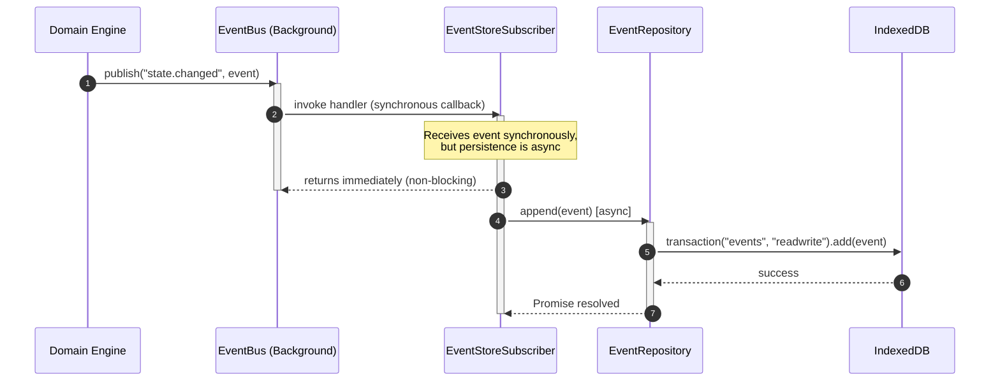
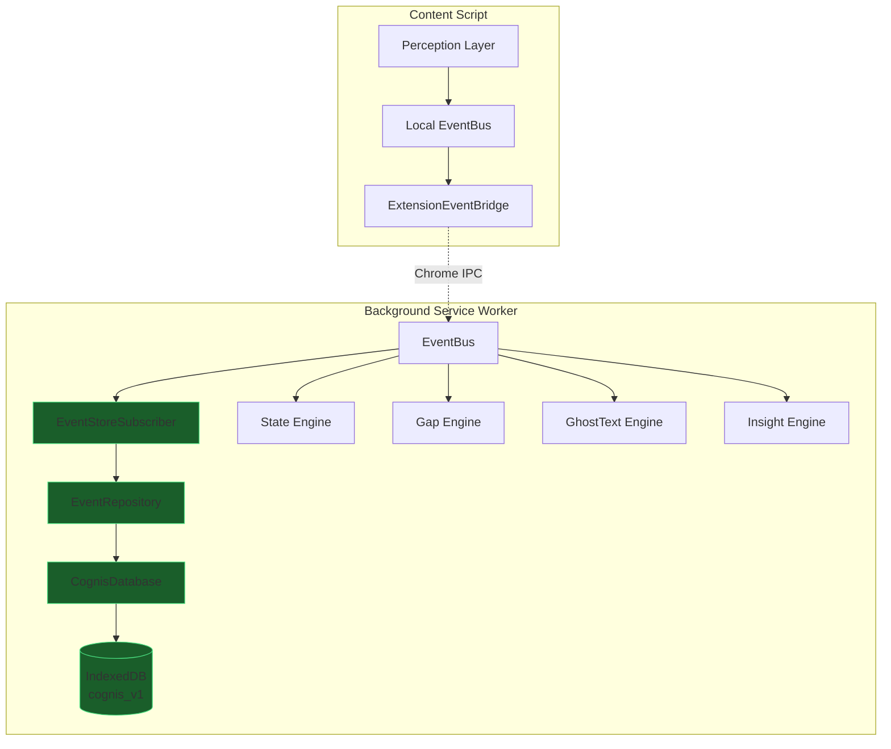
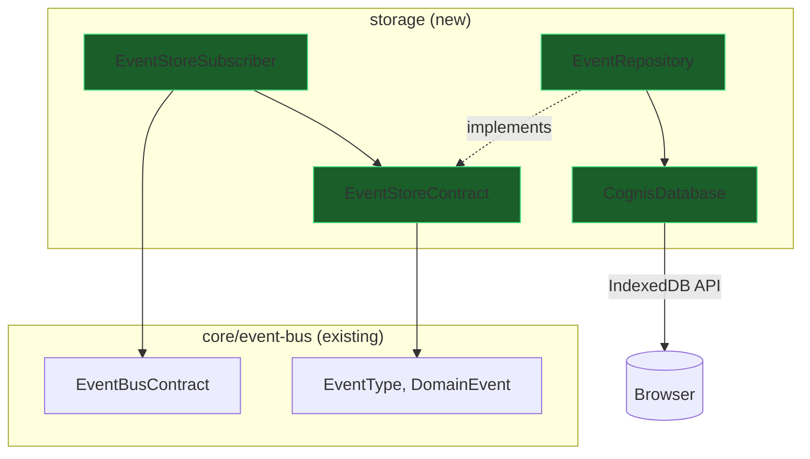

# IndexedDB Event Store — Implementation Plan

**Module**: `src/storage/`
**Owner**: Suchit (Storage Layer) + Naren (Architecture Governance)
**Status**: Draft — Pending Architecture Lead Approval
**Constitution Reference**: Sections 2, 3, 4, 5, 8, 9
**Prerequisites**: Sprint 0.5 Stabilization (ADR-005, Branded Types, EventPayloads cleanup)

---

## 1. Executive Summary

The Event Store is the third major architectural primitive in Cognis, after the Event Contracts and EventBus. It is the persistence layer that subscribes to the EventBus and durably writes every domain event to IndexedDB as an append-only, immutable fact log.

The Event Store does **not** make decisions. It does **not** query. It does **not** build UI state. It records what happened — nothing more.

Every higher-level capability in Cognis — Identity Models, Automaticity Tracking, Gap Profiles, Surface B Visualizations, and future Arc hardware integration — depends on being able to replay the history of what the user did. Without the Event Store, Cognis has no memory.

---

## 2. Architectural Context — Four Layers of Data

Before defining the Event Store, it is critical to understand where it sits in the Cognis data architecture. Per ADR-005, Cognis distinguishes three categories of data:

```
┌─────────────────────────────────────────────────────────────────┐
│                    REFERENCE DATA (Knowledge)                   │
│  Activation Profiles · Gap Taxonomy · Brain Region Definitions  │
│  Bundled JSON · Immutable at runtime · Versioned per release    │
│  Storage: Extension bundle (never IndexedDB)                    │
└─────────────────────────────────────────────────────────────────┘
                              ↕ consulted by
┌─────────────────────────────────────────────────────────────────┐
│                      DOMAIN EVENTS (Facts)                      │
│  prompt.typed · state.changed · gap.detected · 25 event types   │
│  Append-only · Immutable · Replayable · The source of truth     │
│  Storage: IndexedDB `events` object store  ← THIS DOCUMENT      │
└─────────────────────────────────────────────────────────────────┘
                              ↓ consumed by
┌─────────────────────────────────────────────────────────────────┐
│                    READ MODELS (Projections)                     │
│  Identity Profile · Automaticity Score · Gap History · Session  │
│  Derived from events · Rebuildable · Mutable · Queryable        │
│  Storage: IndexedDB `read_models` object store (future)         │
└─────────────────────────────────────────────────────────────────┘
                              ↓ rendered by
┌─────────────────────────────────────────────────────────────────┐
│                      PRESENTATION LAYER                         │
│  Surface A (Ghost Text) · Surface B (Skill Visualization)       │
│  Consumes projections only · Never touches events directly      │
└─────────────────────────────────────────────────────────────────┘
```

**The Event Store is responsible for the second layer only.** It records facts. Projections (Layer 3) are a separate concern, implemented by separate modules, in a later sprint.

---

## 3. Responsibility Boundaries

### What the Event Store IS

| Responsibility | Description |
|----------------|-------------|
| **Append events** | Persist every `DomainEvent<T>` to IndexedDB as an immutable record |
| **Subscribe to EventBus** | Listen to all (or selected) event types on the Background Worker's EventBus |
| **Query by session** | Retrieve all events belonging to a specific `SessionId` |
| **Query by type** | Retrieve all events of a specific `EventType` |
| **Query by time range** | Retrieve events within a `[start, end]` timestamp window |
| **Replay support** | Return ordered event streams that can be fed back into the EventBus |
| **Schema versioning** | Manage IndexedDB version upgrades and data migrations |

### What the Event Store IS NOT

| Anti-Responsibility | Why Not |
|---------------------|---------|
| Business logic | Constitution Section 3 — Domain Engines own decisions |
| Projection building | Read models are a separate concern (Projection Builders) |
| Event routing | The EventBus owns routing — the Store is a subscriber |
| Direct engine access | No engine imports the Event Store directly — they publish events |
| Data transformation | Events are stored exactly as they arrive — no enrichment, no filtering |

### Layer Ownership Map (Constitution Section 10)

| Component | Location | Owner |
|-----------|----------|-------|
| `CognisDatabase` (connection manager) | `src/storage/indexeddb/CognisDatabase.ts` | Suchit |
| `EventStoreSubscriber` (EventBus integration) | `src/storage/indexeddb/EventStoreSubscriber.ts` | Suchit |
| `EventRepository` (CRUD interface) | `src/storage/repositories/EventRepository.ts` | Suchit |
| `EventStoreContract` (interface) | `src/storage/types.ts` | Naren (architecture contract) |
| Future `ProjectionBuilder` | `src/storage/projections/` | Suchit |
| Future `SessionRepository` | `src/storage/repositories/SessionRepository.ts` | Suchit |

---

## 4. IndexedDB Schema Design

### Database Identity

```
Database Name: cognis_v1
```

This is the canonical database name defined in Constitution Section 8. It does **not** change between extension updates. Schema evolution is handled through IndexedDB's built-in versioning mechanism.

### Version 1 Schema

```
Database: cognis_v1 (version 1)
├── Object Store: events
│   ├── keyPath: "id"                    (EventId — unique per event)
│   ├── Index: "by-session"              → sessionId
│   ├── Index: "by-type"                 → type
│   ├── Index: "by-timestamp"            → timestamp
│   ├── Index: "by-session-type"         → [sessionId, type]  (compound)
│   └── Index: "by-session-timestamp"    → [sessionId, timestamp]  (compound)
├── Object Store: user_profiles
│   ├── keyPath: "profileId"
│   └── (future — not implemented in this sprint)
└── Object Store: read_models
    ├── keyPath: "projectionKey"
    └── (future — not implemented in this sprint)
```

### Record Shape

Events are stored exactly as they flow through the EventBus — the `DomainEvent<T>` envelope, serialized as a plain JavaScript object:

```
{
  id: "evt_abc123",              // EventId (string after serialization)
  type: "state.changed",         // EventType
  timestamp: 1719345600000,      // Timestamp (number after serialization)
  sessionId: "sess_xyz789",      // SessionId (string after serialization)
  source: "state-engine",        // string
  payload: {                     // Payload varies per event type
    previousState: "coasting",
    currentState: "stretch",
    confidence: 0.87
  }
}
```

> [!IMPORTANT]
> **Branded types serialize cleanly.** `SessionId`, `EventId`, and `Timestamp` are branded at the TypeScript level only — they serialize as plain `string` and `number` in JSON/IndexedDB. No special serialization logic is needed.

### Index Justification

| Index | Use Case | Query Pattern |
|-------|----------|---------------|
| `by-session` | "Show me everything that happened in this session" | `SessionProjection`, replay |
| `by-type` | "Show me all `gap.detected` events ever" | `GapProfileProjection`, analytics |
| `by-timestamp` | "Show me events from the last 24 hours" | Retention cleanup, debugging |
| `by-session-type` | "Show me all `state.changed` events in this session" | State Engine replay, session analysis |
| `by-session-timestamp` | "Show me this session's events in order" | Full session replay, timeline rendering |

### Why Compound Indexes?

IndexedDB does not support multi-column queries natively. Without compound indexes, querying "all `state.changed` events in session X" would require fetching all events for session X, then filtering client-side. Compound indexes make this a single cursor operation.

---

## 5. Schema Evolution Strategy

IndexedDB uses an integer `version` field. When the database is opened with a higher version than what exists, the `onupgradeneeded` callback fires. This is the **only** time object stores and indexes can be created or modified.

### Migration Architecture

```
Version 1:  events, user_profiles, read_models (initial schema)
Version 2:  (future) add new indexes or object stores
Version N:  (future) handled by migration runner
```

### Migration Runner Design

The `CognisDatabase` class will implement a version-aware migration runner:

1. Define migrations as an ordered array: `migrations: Migration[]`
2. Each migration has a `version: number` and an `upgrade(db, transaction)` function
3. On `onupgradeneeded`, the runner executes all migrations between `oldVersion` and `newVersion` sequentially
4. Migrations are idempotent — if an object store or index already exists, the migration skips it

### Constraints

- IndexedDB schema changes can **only** happen inside `onupgradeneeded`
- Data migrations (transforming existing records) must happen **outside** the upgrade transaction, in a separate post-open step
- The version number is monotonically increasing — it never goes backwards
- Schema changes must be backwards-compatible — old data must remain readable

---

## 6. Repository Interface Design

The `EventRepository` provides the query API for event data. It is the **only** module that touches the `events` object store directly.

### Contract

```
EventStoreContract
├── append(event: DomainEvent<any>): Promise<void>
├── getById(id: EventId): Promise<DomainEvent<any> | undefined>
├── getBySession(sessionId: SessionId): Promise<DomainEvent<any>[]>
├── getByType(type: EventType): Promise<DomainEvent<any>[]>
├── getBySessionAndType(sessionId: SessionId, type: EventType): Promise<DomainEvent<any>[]>
├── getByTimeRange(start: Timestamp, end: Timestamp): Promise<DomainEvent<any>[]>
├── getBySessionOrdered(sessionId: SessionId): Promise<DomainEvent<any>[]>
├── count(): Promise<number>
└── countBySession(sessionId: SessionId): Promise<number>
```

### Design Decisions

**Why `append` instead of `put` or `save`?**
Events are append-only facts. Using `append` in the API name makes the immutability contract explicit. The implementation uses `IDBObjectStore.add()` (not `put()`), which throws if the key already exists — preventing accidental overwrites.

**Why `Promise`-based?**
IndexedDB is inherently asynchronous. All operations return Promises. The EventBus subscriber must not block the synchronous dispatch loop — it receives the event synchronously and enqueues the persistence operation asynchronously.

**Why no `delete` or `update`?**
Events are immutable facts (Constitution Section 2). The Event Store never deletes or modifies individual events. Retention/cleanup (if needed) will be a separate, controlled process with its own audit trail.

**Why no projection queries?**
Projections are derived data. They live in `read_models` and are built by `ProjectionBuilder` modules. The Event Store returns raw events — it does not aggregate, transform, or summarize.

---

## 7. EventBus Integration — Subscriber Architecture

The Event Store connects to the EventBus as a **subscriber**, not as middleware. This is a critical architectural decision.

### Why Subscriber, Not Middleware?

```
❌ Wrong: EventBus → EventStore (middleware) → Subscribers
✅ Right: EventBus → [Subscriber A, Subscriber B, EventStore, Subscriber C]
```

If the Event Store were middleware (intercepting events before other subscribers see them), a storage failure would block all downstream processing. By making the Event Store a regular subscriber, it has the same isolation guarantees as any other listener — if it fails, the EventBus reports the error and continues dispatching to other subscribers.

### Integration Design

A dedicated `EventStoreSubscriber` class:

1. Receives a reference to the local `EventBusContract` and the `EventRepository`
2. On initialization, subscribes to **all** event types in the registry
3. When an event arrives, it calls `eventRepository.append(event)` asynchronously
4. Errors are caught and reported — they never propagate back to the EventBus

### Event Persistence Flow



> [!IMPORTANT]
> **The subscriber handler returns synchronously.** The `append()` call is fire-and-forget from the EventBus's perspective. The EventBus does not wait for IndexedDB. This preserves the < 5ms dispatch latency budget.

### Subscription Registration

The subscriber subscribes to **every** event type. This is intentional:

- The Event Store is the system's memory. It must not selectively forget events.
- If a new event type is added to the registry, the subscriber must automatically pick it up.
- Implementation: iterate over all values in the registry objects (`SessionEvents`, `PromptEvents`, etc.) and subscribe to each.

---

## 8. Transaction Boundaries and Consistency

### Atomicity

Each `append()` operation runs in its own IndexedDB transaction (`readwrite` on `events`). IndexedDB guarantees that if the `add()` succeeds, the data is durably written. If it fails (e.g., duplicate key), the transaction is automatically rolled back.

### Ordering

IndexedDB transactions within a single object store are processed sequentially by the browser. Even if multiple `append()` calls are in flight concurrently, they will be serialized by the browser's transaction queue. This guarantees that events written in rapid succession maintain their temporal ordering.

### Duplicate Prevention

The `events` store uses `id` (EventId) as its `keyPath`. Since `IDBObjectStore.add()` throws a `ConstraintError` if the key already exists, duplicate events are rejected at the storage level. This is the last line of defense — the EventBus bridge's ID caching is the first.

### Failure Recovery

| Failure Mode | Behavior | Recovery |
|--------------|----------|----------|
| **Transaction failure** (quota, constraint) | Promise rejects. Event is lost from storage. | Log via `ErrorReporter`. Event was still delivered to all other subscribers. |
| **Browser crash during write** | IndexedDB auto-rolls back incomplete transactions | Event is lost from storage. No corruption. |
| **Storage quota exceeded** | `QuotaExceededError` on `add()` | Trigger retention cleanup. Log warning. |
| **Database corruption** | `onblocked` or `onerror` on open | Delete and recreate database. Log data loss event. |
| **Service Worker restart** | Database connection closed | Re-open on next event. IndexedDB persists across restarts. |

### Corruption Handling

If `indexedDB.open()` fails with a corruption error, the system should:
1. Log the failure with full diagnostics
2. Attempt to delete the database: `indexedDB.deleteDatabase("cognis_v1")`
3. Re-open with the current schema version (triggering `onupgradeneeded`)
4. Accept that historical data is lost — Cognis starts fresh
5. Surface this to the user via a `system.data.reset` internal event (future)

> [!CAUTION]
> Data loss is acceptable as a last resort. Cognis is a personal cognitive tool — it does not hold financial or medical data. A clean restart is better than a corrupted, unreliable state.

---

## 9. Performance Expectations

### Latency Budgets

| Operation | Target | Notes |
|-----------|--------|-------|
| `append(event)` | < 5ms | Single `add()` in a `readwrite` transaction |
| `getBySession()` | < 20ms | Index cursor scan on `by-session` |
| `getBySessionOrdered()` | < 30ms | Compound index cursor on `by-session-timestamp` |
| `getByType()` | < 50ms | May return large result sets |
| `getByTimeRange()` | < 50ms | Index cursor scan on `by-timestamp` |
| `count()` | < 5ms | `IDBObjectStore.count()` |

### Batching

For v1, the Event Store does **not** batch writes. Each event is written individually in its own transaction. Rationale:

- Event frequency in Cognis is moderate (< 50 events/second during active typing)
- IndexedDB handles individual `readwrite` transactions efficiently
- Batching adds complexity (buffering, flush timing, data loss risk on crash)
- If profiling reveals write contention, batching can be added as an optimization without changing the `EventStoreContract` interface

### Storage Lifecycle

**Estimated storage usage per session:**

| Scenario | Events/Session | Avg Event Size | Total |
|----------|---------------|----------------|-------|
| Light usage (30 min) | ~200 events | ~300 bytes | ~60 KB |
| Heavy usage (2 hours) | ~2,000 events | ~300 bytes | ~600 KB |
| Power user (8 hours/day, 30 days) | ~120,000 events | ~300 bytes | ~36 MB |

IndexedDB storage limits vary by browser:
- **Chrome**: Up to 80% of total disk space (effectively unlimited for our use case)
- **Firefox**: Up to 50% of disk, with per-origin limits (~2 GB default)
- **Safari**: 1 GB per origin (relevant for future Safari extension)

### Retention Strategy (Future)

For v1, there is **no automatic retention or cleanup**. Events accumulate indefinitely. This is intentional:

- Cognis models longitudinal skill development — deleting old data defeats the purpose
- Storage limits are generous for our data volume
- When retention becomes necessary (v2+), it will be implemented as a separate `RetentionPolicy` module that:
  1. Queries events older than a threshold
  2. Optionally snapshots aggregate state before deletion
  3. Deletes in batches with an audit event

---

## 10. What This Sprint Does NOT Implement

The following are explicitly **out of scope** for the Event Store sprint. They are documented here to prevent scope creep and to establish clear boundaries for future work.

| Excluded | Reason | When |
|----------|--------|------|
| **Projection Builders** | Read models are a separate concern | Future sprint (after Event Store is stable) |
| **Session aggregates** | Derived data, not raw events | Projection Builder responsibility |
| **Automaticity scoring** | Domain Engine + Projection concern | Insight Engine sprint |
| **Surface B data queries** | Presentation consumes projections, not raw events | After Projections sprint |
| **Event replay to engines** | Requires engine idempotency contracts | Future replay sprint |
| **Snapshotting** | Optimization — only needed when replay becomes slow | v2+ |
| **Cross-device sync** | Violates Local-First principle unless encrypted | Not planned |
| **Data export** | User-facing feature, not architecture | Product sprint |

---

## 11. Future Evolution

### 11.1 — Replay

The Event Store is designed to enable replay from day one, even though replay itself is not implemented in this sprint.

Replay means: retrieve an ordered stream of historical events and feed them back through the EventBus. This allows:
- Rebuilding projections from scratch (if corrupted or schema-migrated)
- Testing engines against real historical data
- Debugging cognitive state transitions

**Requirements for replay readiness:**
- Events are stored with their original `timestamp` ordering
- The `getBySessionOrdered()` query returns events in timestamp order
- Events are stored as complete `DomainEvent<T>` envelopes — no information is lost
- The EventBus's `publish()` method can accept replayed events identically to live events

### 11.2 — Snapshotting

If a session accumulates 10,000+ events, replaying from scratch becomes slow. Snapshots are periodic checkpoints that capture the current projection state, allowing replay to start from a recent snapshot instead of the beginning.

**Design sketch** (not implemented now):
- A `snapshots` object store with `keyPath: [sessionId, snapshotVersion]`
- Snapshot records contain the projection state at a given timestamp
- Replay starts from the latest snapshot and applies only subsequent events

### 11.3 — Schema Migrations

When new event types are added to the registry, the Event Store schema does **not** change — the `events` store accepts any `DomainEvent<T>` regardless of its `type` field. Schema migrations are only needed when:

- New indexes are required (e.g., indexing on `source`)
- New object stores are added (e.g., `snapshots`)
- The `DomainEvent` envelope shape changes (which is a major breaking change governed by the Constitution)

### 11.4 — Arc Hardware Compatibility

When Arc hardware produces `hardware.signal.received`, `hardware.connected`, and `hardware.disconnected` events, they flow through the EventBus identically to software-generated events. The Event Store subscribes to these event types and persists them without any code changes.

**Zero modifications required.** This is the Arc Readiness Law (Constitution Section 9) in practice.

### 11.5 — Projection Rebuilding

If a projection becomes corrupted or its schema changes, the Projection Builder can:
1. Clear the `read_models` entry for that projection
2. Query all relevant events from the Event Store
3. Rebuild the projection by processing events in order

This is only possible because the Event Store preserves the complete, ordered event history.

---

## 12. Architectural Risks and Tradeoffs

### Risk 1: Async Write Failure ≠ Event Loss

If `append()` fails, the event was still delivered to all other EventBus subscribers (engines, UI). The system continues to function — but the event is missing from the persistent log. This means replaying that session will produce a slightly different state than what actually happened.

**Mitigation**: Log write failures prominently. In v2, consider a write-ahead log (WAL) buffer in memory that retries failed writes.

**Tradeoff accepted**: The alternative — making the EventBus wait for IndexedDB before dispatching to other subscribers — would violate the < 5ms latency budget and couple transport to storage.

### Risk 2: No Backpressure

If events arrive faster than IndexedDB can write them, the browser's transaction queue will grow. In extreme cases, this could cause memory pressure.

**Mitigation**: Cognis' event frequency is moderate (< 50/second). IndexedDB can handle this comfortably. If profiling reveals issues, introduce micro-batching (buffer events for 16ms, write in one transaction).

### Risk 3: Service Worker Lifecycle

Chrome's Manifest V3 service workers can be terminated after 30 seconds of inactivity. If the service worker is killed mid-write, the transaction is rolled back (no corruption, but data loss for that event).

**Mitigation**: Chrome extends the service worker's lifetime while IndexedDB transactions are pending. Additionally, high-frequency events (like `prompt.typed`) can be debounced at the Perception Layer before reaching the EventBus.

### Risk 4: IndexedDB API Ergonomics

The raw IndexedDB API is callback-based and verbose. Wrapping it in Promises is error-prone.

**Mitigation**: The `CognisDatabase` class will provide a thin Promise wrapper over IndexedDB operations. We will **not** use third-party libraries (idb, Dexie) to avoid runtime dependency bloat and maintain full control over transaction behavior.

**Rejected alternative**: Using Dexie.js. While ergonomic, it adds ~40KB to the bundle, has opinions about transaction handling, and introduces a dependency we don't control. The raw API, properly wrapped, is sufficient.

---

## 13. Architecture Diagrams

### System Integration



### Module Dependency Graph



---

## 14. File Inventory

### New Files

| File | Purpose |
|------|---------|
| `src/storage/types.ts` | `EventStoreContract` interface definition |
| `src/storage/indexeddb/CognisDatabase.ts` | Database connection manager, schema versioning, migration runner |
| `src/storage/indexeddb/EventStoreSubscriber.ts` | EventBus subscriber that routes events to the repository |
| `src/storage/repositories/EventRepository.ts` | Implementation of `EventStoreContract` against IndexedDB |

### Modified Files

| File | Change |
|------|--------|
| `src/storage/indexeddb/index.ts` | Replace TODO comment with real exports |
| `src/storage/repositories/EventRepository.ts` | Replace placeholder class with real implementation |

### Unchanged Files

| File | Notes |
|------|-------|
| `src/storage/repositories/SessionRepository.ts` | Remains a placeholder — not in scope |
| `src/storage/repositories/ProfileRepository.ts` | Remains a placeholder — not in scope |
| `src/storage/projections/*` | All remain placeholders — not in scope |
| `src/core/event-bus/*` | Zero modifications. The Event Store is a consumer, not a modifier. |

---

## 15. Testing Strategy

### 15.1 — Unit Tests

**EventRepository**:
- `append()` writes an event and `getById()` retrieves it with identical fields
- `append()` with a duplicate `EventId` throws a `ConstraintError`
- `getBySession()` returns only events matching the given `SessionId`
- `getByType()` returns only events matching the given `EventType`
- `getBySessionAndType()` correctly filters on both dimensions
- `getByTimeRange()` returns events within the specified window (inclusive)
- `getBySessionOrdered()` returns events sorted by `timestamp` ascending
- `count()` returns the correct total event count
- `countBySession()` returns the correct per-session count
- Empty results return empty arrays, not `null` or `undefined`

**CognisDatabase**:
- Opens the database with the correct name and version
- `onupgradeneeded` creates all three object stores
- `onupgradeneeded` creates all five indexes on `events`
- Migration runner executes migrations in version order
- Migration runner skips already-applied migrations (idempotency)
- Database handles `onblocked` gracefully

**EventStoreSubscriber**:
- Subscribes to all event types in the registry
- Calls `append()` when an event is published
- Does not rethrow if `append()` fails (error isolation)
- Reports errors to `ErrorReporter` on failure

### 15.2 — Integration Tests

- Full end-to-end: publish event on EventBus → EventStoreSubscriber receives → EventRepository appends → query back via `getBySession()`
- Verify that the EventBus continues dispatching to other subscribers even if the Event Store's `append()` fails
- Verify timestamp ordering across multiple rapid publishes

### 15.3 — Migration Tests

- Open database at version 1, verify schema
- Open database at version 2 (future), verify migration applies cleanly
- Open database at version 2 when already at version 2, verify no-op
- Verify data written at version 1 is readable after version 2 upgrade

### 15.4 — Failure and Edge Case Tests

- Write when storage quota is exceeded → graceful error, no crash
- Write during service worker shutdown → transaction rolls back, no corruption
- Open database when another tab has it open → `onblocked` handling
- Rapid-fire 1,000 events → all are persisted in correct order

### 15.5 — IndexedDB Testing Environment

IndexedDB is a browser API. For unit tests, we will use one of:
- **fake-indexeddb**: A pure JavaScript in-memory implementation of the IndexedDB API. Zero browser dependency. Runs in Node.js.
- **Vitest browser mode**: Runs tests in a real browser context with actual IndexedDB.

Recommendation: Use `fake-indexeddb` for fast unit tests. Use Vitest browser mode for integration validation.

---

## 16. Definition of Done

- [ ] `CognisDatabase` opens `cognis_v1` with version 1 schema
- [ ] `events`, `user_profiles`, and `read_models` object stores created
- [ ] All five indexes created on `events` store
- [ ] `EventStoreContract` interface defined in `src/storage/types.ts`
- [ ] `EventRepository` implements `EventStoreContract` with all query methods
- [ ] `EventStoreSubscriber` subscribes to all 25 event types
- [ ] `EventStoreSubscriber` persists events asynchronously without blocking EventBus
- [ ] `EventStoreSubscriber` isolates storage failures — never crashes the EventBus
- [ ] Migration runner supports version-aware upgrades
- [ ] All unit tests pass
- [ ] All integration tests pass
- [ ] `tsc --noEmit` passes with zero errors
- [ ] No modifications to any file in `src/core/event-bus/`
- [ ] Documented in `docs/implementation-overviews/`

---

## 17. How This Enables Everything That Comes After

The Event Store is not a feature. It is the **memory** of the system. Without it, every other higher-level capability is impossible.

| Future Module | Dependency on Event Store |
|---------------|--------------------------|
| **Identity Model** | Aggregates `prompt.typed`, `state.changed`, `gap.detected` events to build a longitudinal user profile |
| **Automaticity Tracking** | Queries `automaticity.updated` events over time, cross-references with `ActivationProfile.transition_threshold_hours` from Reference Data |
| **Gap Profile** | Accumulates `gap.detected` events by `GapType` to identify the user's persistent cognitive gaps |
| **Surface B Visualization** | Projections (built from events) power the skill visualization charts, timelines, and cognitive maps |
| **Arc Hardware** | Hardware events (`hardware.signal.received`) are persisted identically to software events — enabling longitudinal analysis of biometric data |
| **Session Replay** | Complete event streams can be replayed to reconstruct any past session's state |
| **Debugging** | Engineers can query the event log to understand exactly what happened, in what order, during any session |
| **A/B Testing** | Compare enrichment effectiveness by replaying sessions with different enrichment parameters |

The Event Store turns Cognis from an application that reacts to the present into a system that learns from the past.

---

*"The purpose of the Event Store is not to store events. It is to make the past queryable, the present explainable, and the future computable."*
