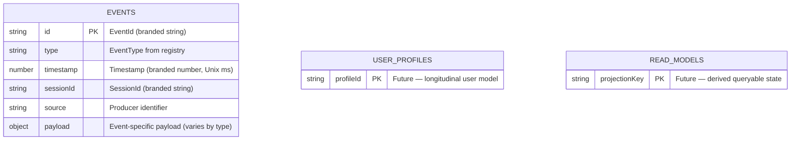
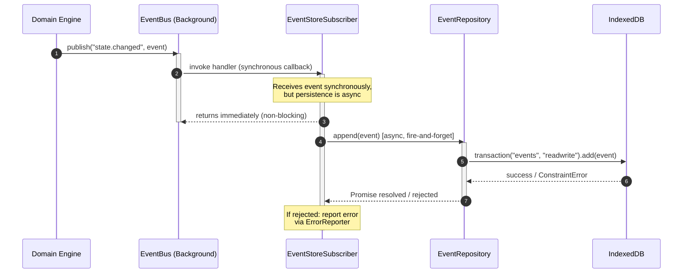
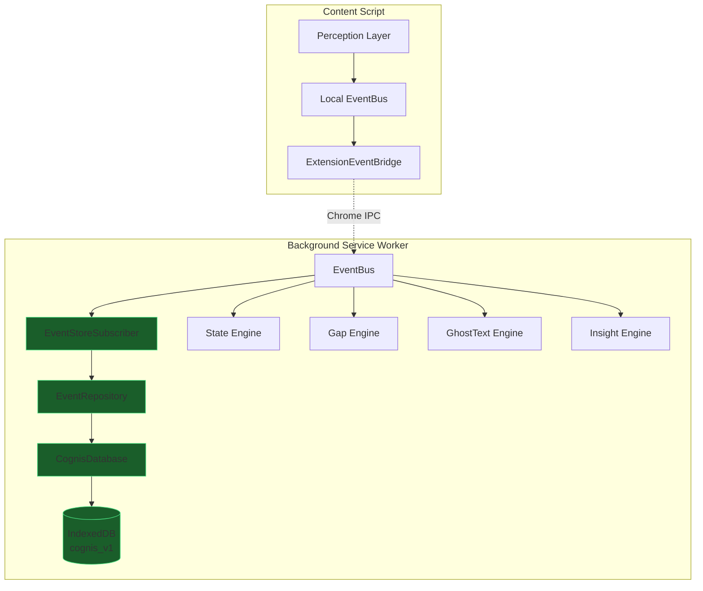
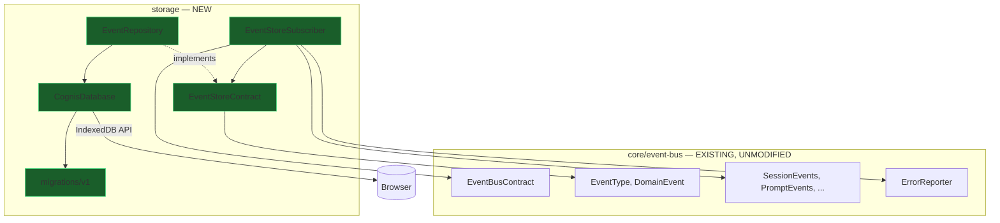
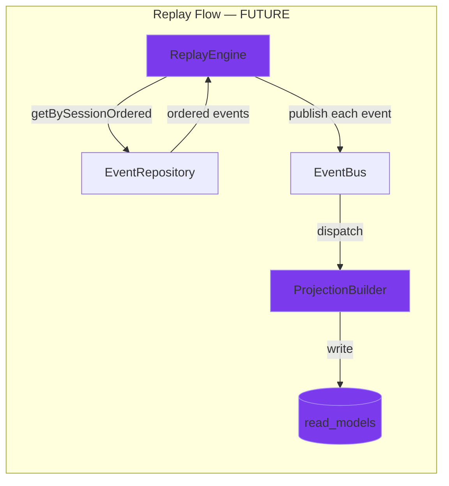

# IndexedDB Event Store — Implementation Plan

**Module**: `src/storage/`
**Owner**: Suchit (Storage Layer) + Naren (Architecture Governance)
**Status**: Draft — Pending Architecture Lead Approval
**Constitution Reference**: Sections 2, 3, 4, 5, 8, 9
**Prerequisites**: Sprint 0.5 Foundational Stabilization (ADR-005, Branded Types, EventPayloads cleanup)
**ADR Sequence**: ADR-006 through ADR-012 (inline)

---

## 1. Why Cognis Requires an Event Store

The EventBus is transport. It delivers events to subscribers in real time, then forgets them. The moment a `state.changed` event is dispatched and all synchronous handlers return, that event ceases to exist. The EventBus has no memory.

Cognis is an event-sourced cognitive operating system. Its core proposition — longitudinal skill tracking, automaticity modeling, identity profiles, gap pattern analysis — depends entirely on the ability to query, aggregate, and replay the history of what the user did across sessions, days, and months. Without durable persistence, every session is amnesia.

The Event Store is the system's memory. It subscribes to the EventBus as a regular listener, receives every domain event, and writes it to IndexedDB as an immutable, append-only fact. It does not decide. It does not transform. It records what happened — nothing more.

### Component Responsibility Map

| Component | Layer | Responsibility | Owns Writes To |
|-----------|-------|---------------|-----------------|
| **EventBus** | Layer 3 (Transport) | Synchronous in-process routing. Publish, subscribe, unsubscribe, route. Zero persistence. Zero business logic. | Nothing. Pure transport. |
| **Event Store** | Layer 5 (Storage) | Durable append-only persistence of domain events. Subscribes to EventBus. Writes to IndexedDB. | `events` object store in IndexedDB |
| **Domain Engines** | Layer 4 (Decision) | State inference, gap detection, ghost text generation, enrichment, insight derivation. | Nothing directly. Engines publish events; they never write to IndexedDB. |
| **Projection Builders** | Layer 5 (Storage, future) | Consume raw events and derive queryable read models (identity profiles, automaticity scores, gap histories). | `read_models` object store in IndexedDB (future) |
| **Reference Data** | Layer 2 (Configuration) | Static, research-derived knowledge (activation profiles, gap taxonomy, brain region definitions). | Nothing. Bundled JSON. Immutable at runtime. Per ADR-005. |

### Why Domain Engines Must Never Write Directly to IndexedDB

This is not a guideline. It is an architectural law (Constitution Section 3, Layer 4 and Layer 5 separation).

1. **Coupling**: If the Gap Engine imports `EventRepository` and calls `append()`, it now depends on storage internals. Replacing IndexedDB with a different backend (e.g., SQLite via OPFS in a future runtime) would require modifying every engine.
2. **Testability**: Engines must be testable with only an `EventBusContract` mock. No database setup. No IndexedDB polyfills. No I/O.
3. **Ordering**: The EventBus guarantees dispatch order. If engines wrote directly, they'd bypass the bus and create ordering ambiguities in the event log.
4. **Arc Readiness**: When Arc hardware produces events, they flow through the EventBus identically to software events. The Event Store persists them automatically. Zero hardware-specific storage code.

The path is always: **Engine → EventBus → EventStoreSubscriber → EventRepository → IndexedDB**. Never: Engine → IndexedDB.

---

## 2. Architectural Context — The Four Data Layers

Per ADR-005 (Data Classification), Cognis distinguishes three categories of data. Combined with the Presentation Layer, the full stack is:

```
┌─────────────────────────────────────────────────────────────────┐
│                    REFERENCE DATA (Knowledge)                   │
│  Activation Profiles · Gap Taxonomy · Brain Region Definitions  │
│  Bundled JSON · Immutable at runtime · Versioned per release    │
│  Storage: Extension bundle (never IndexedDB)                    │
└─────────────────────────────────────────────────────────────────┘
                              ↕ consulted by
┌─────────────────────────────────────────────────────────────────┐
│                      DOMAIN EVENTS (Facts)                      │
│  prompt.typed · state.changed · gap.detected · 25 event types   │
│  Append-only · Immutable · Replayable · The source of truth     │
│  Storage: IndexedDB `events` object store  ← THIS DOCUMENT      │
└─────────────────────────────────────────────────────────────────┘
                              ↓ consumed by
┌─────────────────────────────────────────────────────────────────┐
│                    READ MODELS (Projections)                     │
│  Identity Profile · Automaticity Score · Gap History · Session  │
│  Derived from events · Rebuildable · Mutable · Queryable        │
│  Storage: IndexedDB `read_models` object store (future)         │
└─────────────────────────────────────────────────────────────────┘
                              ↓ rendered by
┌─────────────────────────────────────────────────────────────────┐
│                      PRESENTATION LAYER                         │
│  Surface A (Ghost Text) · Surface B (Skill Visualization)       │
│  Consumes projections only · Never touches events directly      │
└─────────────────────────────────────────────────────────────────┘
```

**The Event Store is responsible for the second layer only.** It records facts. Projections (Layer 3) are a separate concern, implemented by separate modules, in a later sprint.

---

## 3. Repository Layout

### Directory Structure

```
src/storage/
├── types.ts                          [NEW]   EventStoreContract interface
├── indexeddb/
│   ├── index.ts                      [MODIFY] Replace TODO with real exports
│   ├── CognisDatabase.ts             [NEW]   Connection manager, schema, migrations
│   └── EventStoreSubscriber.ts       [NEW]   EventBus → Repository bridge
├── repositories/
│   ├── EventRepository.ts            [MODIFY] Replace placeholder with implementation
│   ├── SessionRepository.ts          [DEFER]  Placeholder — future sprint
│   └── ProfileRepository.ts          [DEFER]  Placeholder — future sprint
├── projections/                      [DEFER]  Entire directory — future sprint
│   ├── GapProfileProjection.ts       [DEFER]  Placeholder
│   ├── SessionProjection.ts          [DEFER]  Placeholder
│   ├── StateProjection.ts            [DEFER]  Placeholder
│   └── SurfaceBProjection.ts         [DEFER]  Placeholder
└── migrations/                       [NEW]   Migration definitions
    └── v1.ts                         [NEW]   Version 1 schema definition
```

### Scope Classification

| Scope | Files | Rationale |
|-------|-------|-----------|
| **This Sprint** | `types.ts`, `CognisDatabase.ts`, `EventStoreSubscriber.ts`, `EventRepository.ts`, `migrations/v1.ts`, `indexeddb/index.ts` | Core Event Store infrastructure |
| **Intentionally Deferred** | `SessionRepository.ts`, `ProfileRepository.ts`, all `projections/*` | These consume events after they are persisted. They depend on the Event Store existing. Building them now would be premature — we'd be designing read models before understanding real query patterns. |

---

## 4. IndexedDB Database Architecture

### 4.1 — Database Identity

```
Database Name:  cognis_v1
```

This is the canonical database name defined in Constitution Section 8. It does **not** change between extension updates. Schema evolution is handled through IndexedDB's built-in versioning mechanism.

### 4.2 — Version 1 Schema

```
Database: cognis_v1 (version 1)
├── Object Store: events
│   ├── keyPath: "id"                    (EventId — unique per event)
│   ├── Index: "by-session"              → sessionId
│   ├── Index: "by-type"                 → type
│   ├── Index: "by-timestamp"            → timestamp
│   ├── Index: "by-session-type"         → [sessionId, type]  (compound)
│   └── Index: "by-session-timestamp"    → [sessionId, timestamp]  (compound)
├── Object Store: user_profiles
│   ├── keyPath: "profileId"
│   └── (future — not implemented in this sprint)
└── Object Store: read_models
    ├── keyPath: "projectionKey"
    └── (future — not implemented in this sprint)
```

### 4.3 — Schema Diagram



### 4.4 — Record Shape

Events are stored exactly as they flow through the EventBus — the `DomainEvent<T>` envelope, serialized as a plain JavaScript object:

```
{
  id: "evt_abc123",              // EventId (string after serialization)
  type: "state.changed",         // EventType
  timestamp: 1719345600000,      // Timestamp (number after serialization)
  sessionId: "sess_xyz789",      // SessionId (string after serialization)
  source: "state-engine",        // string
  payload: {                     // Payload varies per event type
    previousState: "coasting",
    currentState: "stretch",
    confidence: 0.87
  }
}
```

> [!IMPORTANT]
> **Branded types serialize cleanly.** `SessionId`, `EventId`, and `Timestamp` are branded at the TypeScript level only — they serialize as plain `string` and `number` in JSON/IndexedDB. No special serialization logic is needed. No custom `toJSON()`. No deserialization adapters.

### 4.5 — Index Justification

| Index | Key Path | Use Case | Primary Consumer |
|-------|----------|----------|------------------|
| `by-session` | `sessionId` | "All events in this session" | `SessionProjection`, replay |
| `by-type` | `type` | "All `gap.detected` events ever" | `GapProfileProjection`, analytics |
| `by-timestamp` | `timestamp` | "Events from the last 24 hours" | Retention cleanup, debugging |
| `by-session-type` | `[sessionId, type]` | "All `state.changed` in session X" | State Engine replay, session analysis |
| `by-session-timestamp` | `[sessionId, timestamp]` | "Session X events in order" | Full session replay, timeline rendering |

### 4.6 — Why Compound Indexes?

IndexedDB does not support multi-column queries natively. Without compound indexes, querying "all `state.changed` events in session X" would require fetching all events for session X, then filtering client-side. Compound indexes make this a single cursor operation — one index seek, zero post-filtering.

---

## 5. Schema Evolution Strategy

IndexedDB uses an integer `version` field. When the database is opened with a higher version than what exists, the `onupgradeneeded` callback fires. This is the **only** time object stores and indexes can be created or modified.

### 5.1 — Migration Architecture

```
Version 1:  events, user_profiles, read_models (initial schema)
Version 2:  (future) add new indexes or object stores
Version N:  (future) handled by migration runner
```

### 5.2 — Migration Runner Design

The `CognisDatabase` class will implement a version-aware migration runner:

1. Define migrations as an ordered array: `migrations: Migration[]`
2. Each migration has a `version: number` and an `upgrade(db: IDBDatabase, transaction: IDBTransaction)` function
3. On `onupgradeneeded`, the runner executes all migrations between `oldVersion` and `newVersion` sequentially
4. Migrations are idempotent — if an object store or index already exists, the migration checks before creating

### 5.3 — Migration Constraints

- IndexedDB schema changes can **only** happen inside `onupgradeneeded`
- Data migrations (transforming existing records) must happen **outside** the upgrade transaction, in a separate post-open step
- The version number is monotonically increasing — it never decreases
- Schema changes must be backwards-compatible — old data must remain readable after upgrade
- Adding new event types to the registry requires **zero** schema changes — the `events` store accepts any `DomainEvent<T>` regardless of its `type` field

### 5.4 — When Schema Migrations Are Needed

| Change | Requires Migration? |
|--------|-------------------|
| New event type added to registry | **No** — the `events` store is type-agnostic |
| New index on `events` store | **Yes** — new version, create index in `onupgradeneeded` |
| New object store (e.g., `snapshots`) | **Yes** — new version |
| `DomainEvent` envelope shape change | **Yes** — major breaking change governed by Constitution |
| New payload field on an existing event | **No** — IndexedDB stores full objects, new fields are additive |

---

## 6. Component Responsibilities

### 6.1 — CognisDatabase (Connection Manager)

**File**: `src/storage/indexeddb/CognisDatabase.ts`

| Responsibility | Detail |
|---------------|--------|
| Open database | `indexedDB.open("cognis_v1", currentVersion)` wrapped in a Promise |
| Run migrations | Execute version-ordered migration functions in `onupgradeneeded` |
| Provide transactions | Expose a method to obtain read/readwrite transactions on named stores |
| Handle corruption | If `open()` fails, attempt `deleteDatabase()` and re-create |
| Handle `onblocked` | Log and wait — do not force-close other connections |
| Singleton lifecycle | One `CognisDatabase` instance per Service Worker lifetime |

The `CognisDatabase` does **not** contain query logic. It is a connection manager. Queries belong to repositories.

### 6.2 — EventRepository (Query Interface)

**File**: `src/storage/repositories/EventRepository.ts`

The `EventRepository` implements `EventStoreContract` and is the **only** module that touches the `events` object store directly.

```
EventStoreContract
├── append(event: DomainEvent<any>): Promise<void>
├── getById(id: EventId): Promise<DomainEvent<any> | undefined>
├── getBySession(sessionId: SessionId): Promise<DomainEvent<any>[]>
├── getByType(type: EventType): Promise<DomainEvent<any>[]>
├── getBySessionAndType(sessionId: SessionId, type: EventType): Promise<DomainEvent<any>[]>
├── getByTimeRange(start: Timestamp, end: Timestamp): Promise<DomainEvent<any>[]>
├── getBySessionOrdered(sessionId: SessionId): Promise<DomainEvent<any>[]>
├── count(): Promise<number>
└── countBySession(sessionId: SessionId): Promise<number>
```

**Critical API Design Decisions:**

- **`append` not `put` or `save`**: The name makes immutability explicit. Implementation uses `IDBObjectStore.add()` (not `put()`), which throws `ConstraintError` on duplicate keys — preventing accidental overwrites.
- **`Promise`-based**: IndexedDB is inherently asynchronous. The EventBus subscriber must not block the synchronous dispatch loop.
- **No `delete` or `update`**: Events are immutable facts (Constitution Section 2). Retention/cleanup, if ever needed, will be a separate `RetentionPolicy` module with its own audit trail.
- **No aggregation or projection queries**: The Event Store returns raw events. Aggregation is the Projection Builder's responsibility.

### 6.3 — EventStoreSubscriber (EventBus Integration)

**File**: `src/storage/indexeddb/EventStoreSubscriber.ts`

| Responsibility | Detail |
|---------------|--------|
| Subscribe to all event types | Iterate over all registry namespaces and subscribe to each |
| Route events to repository | Call `eventRepository.append(event)` asynchronously |
| Isolate failures | Catch and report errors — never propagate to EventBus |
| Accept `ErrorReporter` | Delegate error logging to the injected reporter |

The subscriber subscribes to **every** event type. This is intentional:
- The Event Store is the system's memory. It must not selectively forget events.
- If a new event type is added to the registry, the subscriber must automatically pick it up.
- Implementation: iterate over all values in the frozen registry objects (`SessionEvents`, `PromptEvents`, `CognitiveEvents`, `GhostTextEvents`, `ResponseEvents`, `InsightEvents`, `HardwareEvents`) and subscribe to each.

### 6.4 — EventStoreContract (Interface)

**File**: `src/storage/types.ts`

The contract interface defines the query API without prescribing implementation. This enables:
- Mock implementations for testing engines that read events
- Future backend swaps (e.g., OPFS SQLite) without changing consumers
- Clear architectural boundary between the contract (Naren, architecture) and implementation (Suchit, storage)

---

## 7. Event Persistence Lifecycle

### 7.1 — Complete Flow



> [!IMPORTANT]
> **The subscriber handler returns synchronously.** The `append()` call is fire-and-forget from the EventBus's perspective. The EventBus does not wait for IndexedDB. This preserves the < 5ms dispatch latency budget (Constitution Section 2).

### 7.2 — Append-Only Semantics

1. Events are **never** updated after write. The `events` store has no `put()` path — only `add()`.
2. Events are **never** deleted individually. If retention becomes necessary (v2+), it will be a bulk operation with its own audit event.
3. The `id` (EventId) is the primary key. `add()` rejects duplicates at the storage level. This is defense-in-depth — the EventBus bridge's ID caching is the first line.

### 7.3 — Immutability Guarantees

| Layer | Mechanism |
|-------|-----------|
| TypeScript | `DomainEvent<T>` fields are `readonly` — compile-time enforcement |
| EventBus | Events are passed by reference but never mutated by the bus |
| IndexedDB | `add()` instead of `put()` — duplicate key = rejection, not overwrite |
| Architecture | No `update()` or `delete()` method exists on `EventStoreContract` |

### 7.4 — Replay Readiness

The Event Store is designed to enable replay from day one, even though the replay engine is not implemented in this sprint.

**Requirements satisfied by this implementation:**
- Events are stored with their original `timestamp` ordering
- `getBySessionOrdered()` returns events sorted by `timestamp` ascending via the `by-session-timestamp` compound index
- Events are stored as complete `DomainEvent<T>` envelopes — no information is lost, no fields are dropped
- The EventBus's `publish()` method can accept replayed events identically to live events

### 7.5 — Ordering Guarantees

- Events within a session are ordered by `timestamp` (the `by-session-timestamp` index)
- IndexedDB transactions within a single object store are processed sequentially by the browser
- Even if multiple `append()` calls are in flight concurrently, they will be serialized by the browser's transaction queue
- `getBySessionOrdered()` leverages the compound index to return events in timestamp-ascending order without client-side sorting

### 7.6 — Timestamp Handling

- All timestamps are `Timestamp` branded types — Unix epoch in milliseconds
- Timestamps are generated at the event source (the engine or perception provider that created the event)
- The Event Store does **not** add its own timestamp — it stores the event exactly as received
- If two events have identical timestamps, their insertion order within the same session is preserved by IndexedDB's sequential transaction processing

### 7.7 — Session Grouping

- Every event carries a `sessionId` field
- The `by-session` and `by-session-*` compound indexes enable efficient per-session queries
- A session is a logical grouping (one continuous user interaction on an AI platform tab)
- The Event Store does not enforce session lifecycle — it stores whatever `sessionId` the event carries

---

## 8. Transaction Boundaries and Consistency

### 8.1 — Atomicity

Each `append()` operation runs in its own IndexedDB transaction (`readwrite` on `events`). IndexedDB guarantees that if the `add()` succeeds, the data is durably written. If it fails (duplicate key, quota exceeded), the transaction is automatically rolled back. No partial writes. No torn records.

### 8.2 — Duplicate Prevention

The `events` store uses `id` (EventId) as its `keyPath`. Since `IDBObjectStore.add()` throws a `ConstraintError` if the key already exists, duplicate events are rejected at the storage level. This is defense-in-depth:

1. **First line**: ExtensionEventBridge's FIFO ID cache prevents echoed duplicates from reaching the EventBus
2. **Second line**: IndexedDB's `add()` rejects any event with an existing `id`

### 8.3 — Failure Recovery

| Failure Mode | Behavior | Recovery |
|--------------|----------|----------|
| **Transaction failure** (quota, constraint) | Promise rejects. Event is lost from storage. | Log via `ErrorReporter`. Event was still delivered to all other EventBus subscribers. |
| **Browser crash during write** | IndexedDB auto-rolls back incomplete transactions. | Event is lost from storage. No corruption. |
| **Storage quota exceeded** | `QuotaExceededError` on `add()` | Log warning. Trigger future retention cleanup. System continues — events still flow through EventBus. |
| **Database corruption** | `onerror` on `open()` | Delete and recreate database (see §8.4). Accept historical data loss. |
| **Service Worker restart** | Database connection closed | Re-open on next event. IndexedDB data persists across Service Worker restarts. |
| **Concurrent tab access** | `onblocked` during version upgrade | Log and wait. Do not force-close other connections. |

### 8.4 — Corruption Handling

If `indexedDB.open()` fails with a corruption error, the system must:

1. Log the failure with full diagnostics via `ErrorReporter`
2. Attempt to delete the database: `indexedDB.deleteDatabase("cognis_v1")`
3. Re-open with the current schema version (triggering `onupgradeneeded`)
4. Accept that historical data is lost — Cognis starts fresh
5. Surface this to the user via a `system.data.reset` internal event (future consideration)

> [!CAUTION]
> Data loss is acceptable as a last resort. Cognis is a personal cognitive tool — it does not hold financial or medical data. A clean restart is better than a corrupted, unreliable state.

---

## 9. Browser-Specific IndexedDB Concerns

### 9.1 — Asynchronous API

The raw IndexedDB API is callback-based and verbose. The `CognisDatabase` class provides a thin Promise wrapper over IndexedDB operations. We will **not** use third-party libraries (idb, Dexie.js).

**Why no Dexie.js?**
- Adds ~40KB to the bundle
- Has opinions about transaction handling that may conflict with our explicit control requirements
- Introduces a runtime dependency we don't own or control
- The raw API, properly wrapped, is sufficient for our use case

The Promise wrapper covers:
- `open()` → resolves with `IDBDatabase`
- `transaction().add()` → resolves on `onsuccess`, rejects on `onerror`
- Cursor-based queries → resolves with collected results array

### 9.2 — Storage Quotas

| Browser | Storage Limit | Notes |
|---------|--------------|-------|
| **Chrome** | Up to 80% of total disk space | Effectively unlimited for our use case |
| **Firefox** | Up to 50% of disk, ~2 GB per-origin default | Generous for our data volume |
| **Safari** | 1 GB per origin | Relevant for future Safari extension |

### 9.3 — Version Upgrades and `onblocked`

When the extension updates and opens the database with a higher version, `onupgradeneeded` fires. If another tab still has the database open at the old version, the `onblocked` event fires on the new connection.

**Handling**: Log the blocked state and wait. Do not call `close()` on other connections — that would require cross-tab coordination. Chrome's Service Worker model means only one background context exists, so `onblocked` is unlikely in practice but must be handled gracefully.

### 9.4 — Offline-First Behavior

IndexedDB is a local-first API. No network is required. All reads and writes operate against the local browser database. This aligns perfectly with the Constitution's Local-First principle (Section 2): "Local functionality must remain operational without network access."

### 9.5 — Concurrent Access Assumptions

- Only the **Background Service Worker** writes events to IndexedDB
- The Side Panel and Content Script do **not** directly access IndexedDB for event storage
- Projections (future) may be read from the Side Panel, but that is a separate concern
- This single-writer model eliminates concurrency conflicts for the `events` store

### 9.6 — Startup Initialization

On Service Worker startup:
1. `CognisDatabase.open()` is called — opens or creates the database
2. If version upgrade is needed, migrations run in `onupgradeneeded`
3. `EventRepository` is instantiated with the database reference
4. `EventStoreSubscriber` is instantiated with the EventBus and EventRepository
5. `EventStoreSubscriber.initialize()` subscribes to all event types
6. The system is ready to persist events

This initialization must be non-blocking and resilient. If the database fails to open, the EventBus continues functioning — events are still delivered to engines. Only persistence is lost.

---

## 10. Performance Expectations

### 10.1 — Latency Budgets

| Operation | Target | Notes |
|-----------|--------|-------|
| `append(event)` | < 5ms | Single `add()` in a `readwrite` transaction |
| `getBySession()` | < 20ms | Index cursor scan on `by-session` |
| `getBySessionOrdered()` | < 30ms | Compound index cursor on `by-session-timestamp` |
| `getByType()` | < 50ms | May return large result sets |
| `getByTimeRange()` | < 50ms | Index cursor scan on `by-timestamp` |
| `count()` | < 5ms | `IDBObjectStore.count()` |

### 10.2 — Event Throughput

Cognis' event frequency is moderate. During active typing, `prompt.typed` events fire on keystroke debounce (~10–50/second). Other events (`state.changed`, `gap.detected`) are far less frequent (< 1/second).

Total expected throughput: **< 50 events/second** during peak activity.

IndexedDB handles individual `readwrite` transactions efficiently at this volume. If profiling reveals write contention, micro-batching (buffer events for 16ms, write in one transaction) can be added without changing the `EventStoreContract` interface.

### 10.3 — No Batching in V1

Each event is written individually in its own transaction. Rationale:
- Event frequency is moderate (< 50/second)
- IndexedDB handles individual transactions efficiently at this scale
- Batching adds complexity: buffering, flush timing, data loss risk on Service Worker kill
- The `EventStoreContract` interface supports batching as a transparent optimization later — no API change needed

### 10.4 — Storage Lifecycle

**Estimated storage usage per session:**

| Scenario | Events/Session | Avg Event Size | Total |
|----------|---------------|----------------|-------|
| Light usage (30 min) | ~200 events | ~300 bytes | ~60 KB |
| Heavy usage (2 hours) | ~2,000 events | ~300 bytes | ~600 KB |
| Power user (8 hours/day, 30 days) | ~120,000 events | ~300 bytes | ~36 MB |

Even the most aggressive usage pattern produces < 50 MB of event data per month. This is well within browser storage limits.

### 10.5 — Indexing Strategy

Five indexes on the `events` store:
- Three single-key indexes (session, type, timestamp) for direct lookups
- Two compound indexes (session+type, session+timestamp) for multi-dimensional queries

This is the minimum viable index set. Additional indexes (e.g., `by-source`) can be added in future versions via schema migration. Each additional index slightly increases write overhead, so indexes are added only when a concrete query pattern demands them.

### 10.6 — Retention Strategy (Future)

For v1, there is **no automatic retention or cleanup**. Events accumulate indefinitely.

This is intentional:
- Cognis models longitudinal skill development — deleting old data defeats the purpose
- Storage limits are generous for our data volume
- When retention becomes necessary (v2+), it will be a separate `RetentionPolicy` module that:
  1. Queries events older than a threshold
  2. Optionally snapshots aggregate state before deletion
  3. Deletes in batches with an audit event

---

## 11. What This Sprint Does NOT Implement

The following are explicitly **out of scope**. They are documented here to prevent scope creep and to establish clear boundaries for future work.

| Excluded | Reason | Future Enablement |
|----------|--------|------------------|
| **Projection Builders** | Read models are a separate concern. Building them now would be premature — we'd be designing read models before understanding real query patterns. | The Event Store's `getBySession()`, `getByType()`, and `getBySessionOrdered()` queries provide all inputs that Projection Builders will need. |
| **Session aggregates** | Derived data, not raw events | `SessionProjection` will query `getBySessionOrdered()` and compute aggregates |
| **Automaticity scoring** | Domain Engine + Projection concern | Insight Engine will consume `automaticity.updated` events from the store |
| **Surface B data queries** | Presentation consumes projections, not raw events | `SurfaceBProjection` will materialize views from stored events |
| **Event replay to engines** | Requires engine idempotency contracts that don't exist yet | `getBySessionOrdered()` returns the ordered stream. A future `ReplayEngine` feeds them to the EventBus. |
| **Snapshotting** | Optimization — only needed when replay becomes slow (10,000+ events per session) | The schema can add a `snapshots` store in a future version migration |
| **Identity Models** | Aggregation of events over time into a user profile | Will be built by `ProfileProjection` consuming events from the store |
| **Gap Profiles** | Aggregation of `gap.detected` events by `GapType` | Will be built by `GapProfileProjection` consuming events from the store |
| **Cross-device sync** | Violates Local-First principle unless encrypted | Not planned. Cognis is local-only. |
| **Data export** | User-facing feature, not architecture | Product sprint — query events and serialize to JSON/CSV |

### How Today's Event Store Enables All of These Later — Without Architectural Changes

The key insight: **every future module is a consumer of the Event Store, not a modifier of it.** The Event Store writes events and answers queries. That's it. Everything else — projections, analytics, replay, export — reads from the same immutable event log.

No new interfaces. No new storage paths. No changes to `EventStoreContract`. The Event Store is the foundation that makes everything else possible by simply existing and being queryable.

---

## 12. Architecture Diagrams

### 12.1 — System Integration



### 12.2 — Module Dependency Graph



### 12.3 — Future Replay Architecture (Not Implemented Now)



---

## 13. Architectural Decision Records

### ADR-006: Append-Only Event Persistence

**Status**: Accepted
**Context**: The Event Store must persist domain events. The question is whether events should be mutable (update/delete allowed) or immutable (append-only).
**Decision**: Events are append-only. No update. No delete. `IDBObjectStore.add()` only.
**Rationale**: Cognis is event-sourced (Constitution Section 2). Events represent historical facts. Mutating them would corrupt the audit trail, break replay, and invalidate projections. Append-only semantics are the foundation of event sourcing.
**Rejected Alternative**: Using `put()` for upsert semantics. This would allow silent overwrites of existing events, violating immutability.
**Risk**: Storage grows indefinitely. Mitigated by generous browser quotas and future retention policy.
**Future Evolution**: If retention becomes necessary, a `RetentionPolicy` module will archive or delete events in controlled batches with audit events.

---

### ADR-007: EventBus Isolation from Storage

**Status**: Accepted
**Context**: Should the EventBus know about persistence? Should `publish()` write to IndexedDB?
**Decision**: The EventBus has zero knowledge of storage. The Event Store is a regular subscriber.
**Rationale**:
- Constitution Section 3 (Layer 3): "No storage. No business logic. No persistence. No intelligence."
- If storage were middleware, a write failure would block all downstream subscribers.
- The EventBus is a pure transport primitive. Coupling it to I/O violates its architectural contract.
**Rejected Alternative**: EventBus-as-middleware that persists before dispatching. This guarantees persistence before processing but violates latency budgets (IndexedDB writes take 1–5ms) and couples transport to storage.
**Risk**: If the subscriber fails to persist, the event is lost from storage (but still delivered to engines). Accepted tradeoff — see §12 Risk 1.

---

### ADR-008: IndexedDB Over Alternatives

**Status**: Accepted
**Context**: Multiple storage APIs are available in browser extensions: `localStorage`, `chrome.storage.local`, IndexedDB, OPFS.
**Decision**: Use IndexedDB as the primary storage backend.
**Rationale**:
- **`localStorage`**: Synchronous, 5 MB limit, string-only values. Immediately disqualified.
- **`chrome.storage.local`**: 10 MB limit (unlimitedStorage bumps to ~unlimited, but API is KV-only, no indexing, no cursors, no transactions). Cannot support structured queries.
- **OPFS (Origin Private File System)**: Promising but requires manual serialization, no built-in indexing, and is not universally available in all extension contexts.
- **IndexedDB**: Asynchronous, structured, indexed, transactional, unlimited storage in Chrome extensions, available in Service Workers. Purpose-built for this use case.
**Rejected Alternative**: Dexie.js wrapper over IndexedDB. Adds bundle size (~40KB) and runtime dependency for marginal ergonomic benefit. Raw IndexedDB, properly wrapped, is sufficient.
**Future Evolution**: If OPFS + SQLite becomes mature and standardized, a future `CognisDatabase` implementation could swap the backend while preserving the `EventStoreContract` interface.

---

### ADR-009: Repository Abstraction Pattern

**Status**: Accepted
**Context**: Should storage operations be accessed directly via IndexedDB, or through a repository interface?
**Decision**: All storage access goes through repository classes that implement typed contracts (`EventStoreContract`).
**Rationale**:
- **Testability**: Engines and future consumers can mock `EventStoreContract` without IndexedDB.
- **Swappability**: The backend can change (IndexedDB → OPFS SQLite) without modifying consumers.
- **Encapsulation**: Transaction management, error handling, and cursor logic are hidden behind clean async methods.
- **Constitution alignment**: Layer 5 (Storage) has clear internal boundaries.
**Rejected Alternative**: Direct `IDBObjectStore` access from multiple modules. This would scatter transaction management across the codebase.

---

### ADR-010: Migration Philosophy — Forward-Only, Idempotent

**Status**: Accepted
**Context**: How should schema changes be managed as the database evolves?
**Decision**: Migrations are forward-only (no rollback), version-ordered, and idempotent.
**Rationale**:
- IndexedDB's `onupgradeneeded` is inherently forward-only — the version number never decreases.
- Rollback in IndexedDB is impractical because schema changes (creating/deleting object stores) cannot be conditionally reversed within a single upgrade transaction.
- Idempotency (check-before-create) prevents errors if a migration partially completed before a previous crash.
**Rejected Alternative**: Rollback-capable migrations. IndexedDB's upgrade mechanism does not support this. The complexity is not justified.
**Future Evolution**: If data migrations (transforming existing records) become necessary, they will run as a post-open step, not inside `onupgradeneeded`.

---

### ADR-011: Replay Strategy — Store Now, Replay Later

**Status**: Accepted
**Context**: Should the Event Store include replay functionality in v1?
**Decision**: The Event Store provides the data foundation for replay (ordered queries, complete envelopes) but does not implement replay itself.
**Rationale**:
- Replay requires engine idempotency contracts that do not yet exist.
- Replay requires a `ReplayEngine` that coordinates event ordering, pacing, and subscriber state reset.
- Building replay before engines are implemented would be speculative engineering.
- The critical requirement is that the Event Store's query API is replay-ready — `getBySessionOrdered()` returns the exact data stream a future `ReplayEngine` needs.
**Risk**: If the Event Store's ordering guarantees are wrong, replay will produce incorrect state. Mitigated by comprehensive ordering tests.

---

### ADR-012: Projection Separation — Events ≠ Views

**Status**: Accepted
**Context**: Should the Event Store also build and maintain read models (projections)?
**Decision**: The Event Store is responsible for raw event persistence only. Projection building is a separate concern, implemented by separate modules (`src/storage/projections/`), in a later sprint.
**Rationale**:
- Events are facts. Projections are interpretations. Mixing them in one module violates single responsibility.
- Projection schemas evolve independently from the event schema. A change in how automaticity scores are calculated should not touch the Event Store.
- Projection corruption is recoverable: clear the projection and rebuild from events. This is only possible if events and projections are separate.
- Premature projection design (before engines exist) would likely produce wrong schemas.
**Future Evolution**: Projection Builders will subscribe to the EventBus for real-time updates and use `EventRepository` queries for bulk rebuilds.

---

## 14. File Inventory

### New Files

| File | Purpose |
|------|---------|
| `src/storage/types.ts` | `EventStoreContract` interface definition |
| `src/storage/indexeddb/CognisDatabase.ts` | Database connection manager, schema versioning, migration runner, Promise wrapper |
| `src/storage/indexeddb/EventStoreSubscriber.ts` | EventBus subscriber that routes events to the repository |
| `src/storage/migrations/v1.ts` | Version 1 schema definition (object stores and indexes) |

### Modified Files

| File | Change |
|------|--------|
| `src/storage/indexeddb/index.ts` | Replace TODO comment with real exports |
| `src/storage/repositories/EventRepository.ts` | Replace placeholder class with full implementation |

### Unchanged Files

| File | Notes |
|------|-------|
| `src/storage/repositories/SessionRepository.ts` | Remains a placeholder — not in scope |
| `src/storage/repositories/ProfileRepository.ts` | Remains a placeholder — not in scope |
| `src/storage/projections/*` | All remain placeholders — not in scope |
| `src/core/event-bus/*` | **Zero modifications.** The Event Store is a consumer, not a modifier of the EventBus. |
| `src/core/types/*` | Zero modifications. Branded types serialize cleanly. |
| `src/core/config/*` | Zero modifications. Reference Data is independent. |

---

## 15. Testing Strategy

### 15.1 — Unit Tests: EventRepository

| Test | Assertion |
|------|-----------|
| `append()` writes an event | `getById()` retrieves it with identical fields |
| `append()` with duplicate `EventId` | Throws `ConstraintError` — immutability enforced |
| `getBySession()` | Returns only events matching the given `SessionId` |
| `getByType()` | Returns only events matching the given `EventType` |
| `getBySessionAndType()` | Correctly filters on both dimensions |
| `getByTimeRange()` | Returns events within the specified window (inclusive bounds) |
| `getBySessionOrdered()` | Returns events sorted by `timestamp` ascending |
| `count()` | Returns correct total event count |
| `countBySession()` | Returns correct per-session count |
| Empty results | Returns empty arrays, not `null` or `undefined` |

### 15.2 — Unit Tests: CognisDatabase

| Test | Assertion |
|------|-----------|
| Opens database | Correct name (`cognis_v1`) and version |
| `onupgradeneeded` | Creates all three object stores (`events`, `user_profiles`, `read_models`) |
| `onupgradeneeded` | Creates all five indexes on `events` |
| Migration runner | Executes migrations in version order |
| Migration idempotency | Skips already-existing stores/indexes |
| `onblocked` handling | Logs gracefully, does not throw |
| Corruption recovery | Deletes and recreates database on open failure |

### 15.3 — Unit Tests: EventStoreSubscriber

| Test | Assertion |
|------|-----------|
| Subscribes to all event types | Subscription count matches registry size (25 event types) |
| Event arrival | Calls `append()` when event is published on EventBus |
| Error isolation | Does not rethrow if `append()` rejects |
| Error reporting | Reports errors to `ErrorReporter` on `append()` failure |

### 15.4 — Integration Tests

| Test | Assertion |
|------|-----------|
| Full lifecycle | publish on EventBus → Subscriber receives → Repository appends → query back via `getBySession()` |
| EventBus independence | EventBus continues dispatching to other subscribers even if Event Store's `append()` fails |
| Ordering under load | Rapidly publish 100 events → all persisted in timestamp order |
| Multi-session isolation | Events from session A do not appear in `getBySession(sessionB)` |

### 15.5 — Migration Tests

| Test | Assertion |
|------|-----------|
| Fresh install | Version 1 schema created correctly |
| Version 1 → Version 2 (future) | Migration applies cleanly |
| Idempotent re-open | Opening at same version produces no errors |
| Data survival | Events written at version 1 are readable after version 2 upgrade |

### 15.6 — Failure and Edge Case Tests

| Test | Assertion |
|------|-----------|
| Quota exceeded | Graceful `QuotaExceededError` — no crash, error reported |
| Rapid-fire events | 1,000 events written and persisted in correct order |
| Empty database queries | All query methods return empty arrays |
| Invalid event (no `id`) | `add()` fails — error caught and reported |

### 15.7 — Testing Environment

IndexedDB is a browser API. For unit tests, we will use:

- **`fake-indexeddb`**: A pure JavaScript in-memory implementation of the IndexedDB API. Zero browser dependency. Runs in Node.js. Fast.
- **Vitest browser mode**: Runs tests in a real browser context with actual IndexedDB. Use for integration validation.

**Recommendation**: Use `fake-indexeddb` for all unit tests (fast, deterministic). Use Vitest browser mode for a small set of smoke tests validating real browser behavior.

---

## 16. Architectural Risks and Tradeoffs

### Risk 1: Async Write Failure ≠ Event Loss

If `append()` fails, the event was still delivered to all other EventBus subscribers (engines, UI). The system continues to function — but the event is missing from the persistent log. Replaying that session will produce a slightly different state than what actually happened.

**Mitigation**: Log write failures prominently via `ErrorReporter`. In v2, consider a write-ahead log (WAL) buffer in memory that retries failed writes.

**Tradeoff accepted**: The alternative — making the EventBus wait for IndexedDB before dispatching — would violate the < 5ms latency budget and couple transport to storage.

### Risk 2: No Backpressure

If events arrive faster than IndexedDB can write, the browser's transaction queue grows. In extreme cases, this could cause memory pressure.

**Mitigation**: Cognis' event frequency is moderate (< 50/second). IndexedDB handles this comfortably. If profiling reveals issues, micro-batching can be introduced without API changes.

### Risk 3: Service Worker Lifecycle

Chrome's Manifest V3 service workers can be terminated after 30 seconds of inactivity. If killed mid-write, the transaction rolls back (no corruption, but data loss for that event).

**Mitigation**: Chrome extends the Service Worker's lifetime while IndexedDB transactions are pending. High-frequency events (`prompt.typed`) are debounced at the Perception Layer before reaching the EventBus.

### Risk 4: IndexedDB API Ergonomics

The raw IndexedDB API is callback-based and verbose. Wrapping it in Promises is error-prone.

**Mitigation**: `CognisDatabase` provides a carefully tested Promise wrapper. All transaction and cursor operations are encapsulated. Repository consumers never touch raw IndexedDB.

---

## 17. Definition of Done

A Staff Engineer reviewing the PR should be able to verify every item:

- [ ] `CognisDatabase` opens `cognis_v1` with version 1 schema
- [ ] `events`, `user_profiles`, and `read_models` object stores created in `onupgradeneeded`
- [ ] All five indexes created on `events` store (`by-session`, `by-type`, `by-timestamp`, `by-session-type`, `by-session-timestamp`)
- [ ] `EventStoreContract` interface defined in `src/storage/types.ts` with all query methods
- [ ] `EventRepository` implements `EventStoreContract` using `IDBObjectStore.add()` (not `put()`)
- [ ] `EventStoreSubscriber` subscribes to all 25 event types in the registry
- [ ] `EventStoreSubscriber` persists events asynchronously without blocking the EventBus dispatch loop
- [ ] `EventStoreSubscriber` catches and reports storage errors — never crashes the EventBus
- [ ] Migration runner supports version-aware sequential upgrades
- [ ] Migrations are idempotent — re-running produces no errors
- [ ] Promise wrapper handles all IndexedDB callbacks correctly (success, error, blocked)
- [ ] All unit tests pass (EventRepository, CognisDatabase, EventStoreSubscriber)
- [ ] All integration tests pass (end-to-end persistence flow)
- [ ] `tsc --noEmit` passes with zero errors
- [ ] **Zero modifications to any file in `src/core/event-bus/`**
- [ ] **Zero modifications to any file in `src/core/types/`**
- [ ] Documented in `docs/implementation-overviews/`
- [ ] All ADRs (006–012) recorded in `docs/adrs/`

---

## 18. How This Enables Everything That Comes After

The Event Store is not a feature. It is the **memory** of the system. Without it, every higher-level capability is impossible.

| Future Module | Dependency on Event Store |
|---------------|-----------------------------|
| **Identity Model** | Aggregates `prompt.typed`, `state.changed`, `gap.detected` events to build a longitudinal user profile |
| **Automaticity Tracking** | Queries `automaticity.updated` events over time, cross-references with `ActivationProfile.transition_threshold_hours` from Reference Data |
| **Gap Profile** | Accumulates `gap.detected` events by `GapType` to identify persistent cognitive gaps |
| **Surface B Visualization** | Projections (built from events) power skill charts, timelines, and cognitive maps |
| **Arc Hardware** | Hardware events (`hardware.signal.received`) are persisted identically to software events — enabling longitudinal biometric analysis |
| **Session Replay** | Complete event streams can be replayed to reconstruct any past session's state |
| **Debugging** | Engineers can query the event log to understand exactly what happened, in what order, during any session |
| **A/B Testing** | Compare enrichment effectiveness by replaying sessions with different enrichment parameters |

The Event Store turns Cognis from an application that reacts to the present into a system that learns from the past.

---

*"The purpose of the Event Store is not to store events. It is to make the past queryable, the present explainable, and the future computable."*
