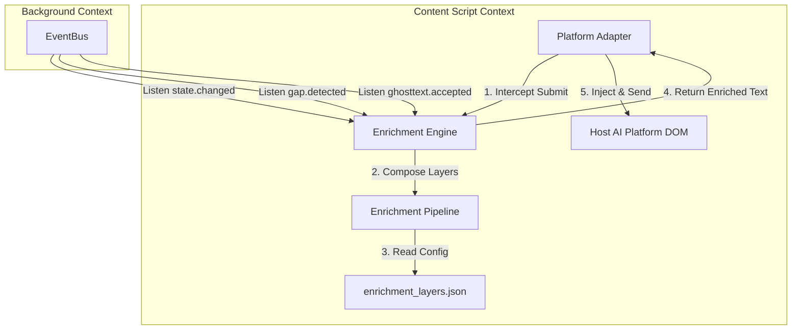
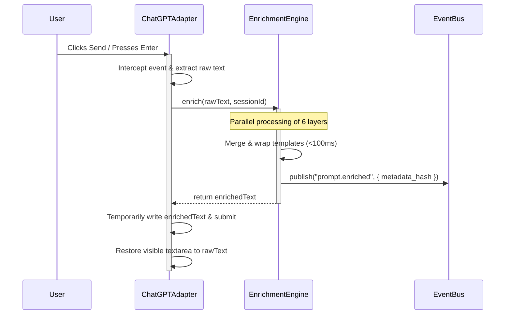

# Week 2: Enrichment Engine — Implementation Plan

**Module**: `src/engines/enrichment/`
**Owner**: Naren (Architecture Governance)
**Status**: Draft — Pending Architecture Lead Approval
**Constitution Reference**: Section 2 (Local-First), Section 3 (Module Boundaries), Section 10 (Latency Budgets)

---

## 1. Executive Summary

This implementation plan defines the architecture, data flow, and components for the **Enrichment Engine**. The Enrichment Engine is a pure, platform-independent domain service executing within the Content Script context. It intercepts prompt submission to append context-aware guidance ("wrapping") before forwarding to the host AI, while keeping the user's visible input completely untouched.

In accordance with the **Cognis Engineering Constitution**, raw prompt text is treated as transient sensory input and is never persisted to the Event Store or sent over IPC. The Enrichment Engine processes text in-memory and outputs the final wrapped payload directly back to the Platform Adapter.

---

## 2. Architectural Role & Module Boundaries

The Enrichment Engine acts as the final processing gate of the Surface A loop. It bridges domain observations (cognitive state, gaps, history) and the host AI platform.



### Module Boundaries
- **Consumes (In-Memory)**: Raw prompt text, active Session ID.
- **Consumes (via EventBus)**: `state.changed`, `gap.detected`, `ghosttext.accepted`, and activation profiles.
- **Produces (via EventBus)**: `prompt.enriched` (carrying metadata, hashes, and timing metrics—strictly no raw text).
- **Produces (In-Memory)**: Enriched prompt string (returned synchronously/asynchronously to the Platform Adapter).

---

## 3. Enrichment Pipeline & Composition Layers

The engine structures prompt enrichment by "wrapping" the user's raw prompt inside a contextual sandbox. The wrapper is composed of six distinct, decoupled layers.

```
+-------------------------------------------------------------+
| 1. State & Identity Layer (User Preferences, Focus Level)  |
+-------------------------------------------------------------+
| 2. Task Frame Layer (Active Sprint/Task Context)            |
+-------------------------------------------------------------+
| 3. Gap Resolution Layer (Heuristic Guidance for Gaps)       |
+-------------------------------------------------------------+
|                                                             |
|   USER'S RAW PROMPT (Untouched)                             |
|                                                             |
+-------------------------------------------------------------+
| 4. Output Structure Layer (Format Layout Rules)             |
+-------------------------------------------------------------+
| 5. Constraints Layer (Behavioral & Safety Restrictions)    |
+-------------------------------------------------------------+
```

### Composed Layers Details

1. **State Layer**: Evaluates the user's focus levels and cognitive state (e.g. if the state is `fatigued`, instructions are wrapped to request shorter, more direct responses from the AI).
2. **Identity Layer**: Injects user preferences and cognitive profiles (e.g. "prefers step-by-step reasoning").
3. **Task Frame Layer**: Supplies the current task domain or project focus.
4. **Gap Heuristics Layer**: If a gap was detected (e.g. `gap.detected` carrying type `under-specified-logic`), this layer appends hints suggesting the AI request clarification or outline edge cases.
5. **Constraints Layer**: Injects safety boundaries or negative constraints (e.g. "Do not write code unless requested").
6. **Output Structure Layer**: Defines formatting guidelines (e.g. "use markdown tables for comparative analysis").

---

## 4. ADR-016: Configurable Layer Precedence and Conflict Resolution

### Context
When assembling the six layers, constraints and instructions may conflict. For example, the State Layer might request brief output, while the Output Structure Layer requests exhaustive details.

### Decision
We will define an external configuration file `enrichment_layers.json` containing precedence scores (0 to 100). Higher scores override lower ones. The Constraints Layer will possess the highest priority (90+), while the State Layer dynamically adjusts its priority based on cognitive intensity.

### JSON Schema Specification (`enrichment_layers.schema.json`)
```json
{
  "$schema": "http://json-schema.org/draft-07/schema#",
  "title": "EnrichmentLayersConfig",
  "type": "object",
  "properties": {
    "settings": {
      "type": "object",
      "properties": {
        "latencyTimeoutMs": { "type": "integer", "default": 100 },
        "enableCaching": { "type": "boolean", "default": true }
      },
      "required": ["latencyTimeoutMs", "enableCaching"]
    },
    "layers": {
      "type": "object",
      "properties": {
        "identity": { "$ref": "#/definitions/LayerConfig" },
        "taskFrame": { "$ref": "#/definitions/LayerConfig" },
        "gapResolution": { "$ref": "#/definitions/LayerConfig" },
        "constraints": { "$ref": "#/definitions/LayerConfig" },
        "outputStructure": { "$ref": "#/definitions/LayerConfig" }
      },
      "required": ["identity", "taskFrame", "gapResolution", "constraints", "outputStructure"]
    }
  },
  "definitions": {
    "LayerConfig": {
      "type": "object",
      "properties": {
        "defaultPriority": { "type": "integer", "minimum": 0, "maximum": 100 },
        "template": { "type": "string" }
      },
      "required": ["defaultPriority", "template"]
    }
  }
}
```

---

## 5. ADR-017: Non-Intrusive Prompt Submission Interception

### Context
To implement prompt wrapping, we must intercept the prompt submission before it is transmitted. However, rewriting the text inside the HTML `textarea` directly degrades the user experience (UX) and violates the Ghost Text philosophy (we do not alter the user's visible text).

### Decision
The Platform Adapter will intercept the browser DOM `submit` event (or keypress/click triggers). 
1. The adapter intercepts the submit flow, cancelling the default browser action.
2. It extracts the raw prompt text from the DOM.
3. It passes the text to `EnrichmentEngine.enrich(rawText)`.
4. The Enrichment Engine returns the wrapped text within the 100ms budget. If it times out or throws an error, the pipeline falls back to the raw prompt immediately.
5. The Platform Adapter programmatically injects the enriched text directly into the network payload or sets the underlying textarea value *instantly before* dispatching the submission request, then immediately restores the textarea's visible content to the user's original text.

---

## 6. Execution Pipeline & Sequence



---

## 7. Interfaces & Contracts

### Enrichment Engine Class Definition
```typescript
export interface EnrichmentEngineOptions {
  readonly configPath?: string;
  readonly latencyTimeoutMs?: number;
}

export class EnrichmentEngine {
  constructor(
    private readonly eventBus: EventBusContract,
    options?: EnrichmentEngineOptions
  ) {}

  public start(): void;
  public stop(): void;

  /**
   * The core in-memory entry point. Resolves within the latency budget
   * or falls back to raw text.
   */
  public async enrich(rawText: string, sessionId: string): Promise<string>;
}
```

### Event Contracts (via `registry.ts`)
We register the metadata event:
```typescript
export const PromptEnrichedEvent = {
  type: 'prompt.enriched',
  payload: {
    sessionId: string;
    originalLength: number;
    enrichedLength: number;
    appliedLayers: string[];
    processingTimeMs: number;
    textHash: string; // SHA-256 for replay matching; no raw text
  }
};
```

---

## 8. Rollout Plan & Testing Strategy

### Phase 1: Engine Skeleton & Loader
Implement `EnrichmentEngine` class, JSON parser, and the layer configuration logic in `src/engines/enrichment/`.

### Phase 2: Pipeline Execution & Merging
Write the template compiler and the conflict resolution logic based on priority levels.

### Phase 3: Platform Integration
Modify `ChatGPTAdapter` to bind to the submission trigger, invoke the pipeline, and perform the transient inject-and-restore process.

### Testing Strategy
1. **Unit Tests (`EnrichmentEngine.spec.ts`)**: Mock the EventBus and config files. Verify precedence rules (higher priority layers override lower ones).
2. **Performance Assertions**: Measure processing latency under load to ensure it consistently stays below 100ms.
3. **Isolation Tests**: Verify that injecting a throwing error into `EnrichmentEngine` allows the Platform Adapter to complete raw prompt submission uninterrupted.
4. **Constitution Linting**: Confirm that `src/engines/enrichment/` makes zero reference to `document`, `window`, or Chrome extension DOM interfaces.

---

## 9. Constitutional Verification

- **Section 2 (Local First)**: Enforced. Prompt text is never placed on the `EventBus` or stored in IndexedDB. Only the cryptographic hash of the raw prompt is emitted.
- **Section 3 (Module Boundaries)**: Enforced. The engine is platform-agnostic; it does not know if it is wrapping text for ChatGPT, Claude, or future Arc hardware signals.
- **Section 10 (Latency Budgets)**: Enforced. All layer resolution is in-memory mapping and executes within 100ms. A safety timeout ensures no blockage if an engine thread freezes.
- **Section 9 (Arc Readiness)**: Enforced. Future Arc hardware data feeds the State Layer via the standard `state_score` database schema, requiring no changes to the enrichment pipeline logic.
