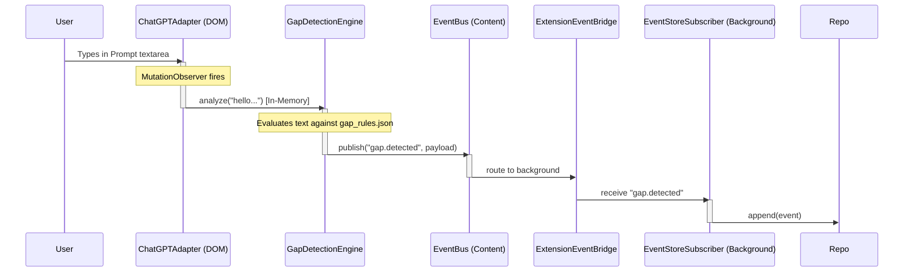

# Week 2 Foundation Gaps — Implementation Plan

**Module**: `src/core/error`, `src/bootstrap`, `src/platforms`
**Owner**: Naren (Architecture Governance)
**Status**: Draft — Pending Architecture Lead Approval
**Constitution Reference**: Sections 2 (Local-First), 3 (Module Boundaries), 6 (Composability)

---

## 1. Executive Summary

This plan addresses three critical foundation gaps identified at the end of Week 1:
1. **ErrorReporter Hierarchy**: Creating a concrete implementation to surface critical storage and runtime failures without coupling the EventBus to specific telemetry tools.
2. **Application Composition Root**: Designing the bootstrap layer responsible for dependency injection, lifecycle management, and runtime wiring of the decoupled foundation modules.
3. **Platform Adapter Wiring**: Establishing the architecture that connects host AI platforms (ChatGPT, Claude) to the domain engines, ensuring DOM APIs and `MutationObservers` remain strictly isolated from pure business logic.

---

## 2. ADR-013: Concrete ErrorReporter Hierarchy

### Context
`EventStoreSubscriber` currently traps IndexedDB errors and routes them to an abstract `ErrorReporter` interface to prevent `EventBus` crashes. Without a concrete implementation, these errors are swallowed, risking silent data loss (e.g., IndexedDB quota exhaustion). 

### Decision
We will implement a composite reporting hierarchy that satisfies the existing `ErrorReporter` interface defined in `src/core/event-bus/types.ts`.

### Proposed Structure
- **`CompositeErrorReporter`**: Implements `ErrorReporter` and holds an array of other reporters. Multiplexes errors to all registered reporters.
- **`ConsoleErrorReporter`**: A basic reporter that formats and outputs errors to `console.error` with rich context mapping. Ideal for development and debugging.
- **`DebugUIErrorReporter` (Future)**: Will route critical failures to Surface B for user visibility.

**Location**: `src/core/error/`

### Interface Adherence
The implementations will strictly adhere to:
```typescript
interface ErrorReporter {
  report(error: unknown, context: Record<string, unknown>): void;
}
```
*No external logging libraries or analytics SDKs will be coupled into the core.*

---

## 3. ADR-014: Composition Root and Context Bootstrapping

### Context
Cognis components are highly decoupled. The `EventBus`, `CognisDatabase`, `GapDetectionEngine`, and `EventStoreSubscriber` take their dependencies via constructors. We need a central location to wire these dependencies based on the browser extension execution context (Background vs. Content Script).

### Decision
We will implement the **Composition Root** pattern. Two separate bootstrap entry points will be created: one for the Background Service Worker and one for the Content Script.

### Background Context (`src/background/index.ts`)
**Responsibilities**:
1. Instantiate `ErrorReporter` (Console).
2. Instantiate `EventBus`.
3. Instantiate `ExtensionEventBridge` (Host mode).
4. Instantiate `CognisDatabase` (with v1 and v2 migrations).
5. Instantiate `EventRepository`.
6. Instantiate `EventStoreSubscriber` and call `subscribeToAll()`.

### Content Script Context (`src/content/index.ts`)
**Responsibilities**:
1. Instantiate `ErrorReporter` (Console).
2. Instantiate `EventBus`.
3. Instantiate `ExtensionEventBridge` (Client mode).
4. Instantiate `GapDetectionEngine` (injecting EventBus).
5. Instantiate `GhostTextEngine` (injecting EventBus).
6. Instantiate `PlatformManager` (injecting engines).

### Dependency Graph & Initialization Order
```mermaid
graph TD
    subgraph Content Script Context
        C_ER[ConsoleErrorReporter]
        C_EB[EventBus]
        C_Bridge[ExtensionEventBridge Client]
        Gap[GapDetectionEngine]
        Ghost[GhostTextEngine]
        PM[PlatformManager]
        Adapter[ChatGPT/Claude Adapter]
        
        C_ER --> C_EB
        C_EB --> C_Bridge
        C_EB --> Gap
        C_EB --> Ghost
        Gap --> PM
        Ghost --> PM
        PM --> Adapter
    end

    subgraph Background Context
        B_ER[ConsoleErrorReporter]
        B_EB[EventBus]
        B_Bridge[ExtensionEventBridge Host]
        DB[CognisDatabase]
        Repo[EventRepository]
        Sub[EventStoreSubscriber]
        
        B_ER --> B_EB
        B_ER --> Sub
        B_EB --> B_Bridge
        B_EB --> Sub
        DB --> Repo
        Repo --> Sub
    end

    C_Bridge <. IPC Message Passing .> B_Bridge
```

---

## 4. ADR-015: Platform Adapter Wiring

### Context
Engines like `GapDetectionEngine` expose an `analyze(text: string)` method that must be fed by live prompt text. The Engineering Constitution strictly forbids engines from touching DOM APIs or `MutationObservers`.

### Decision
We will implement a `PlatformManager` and platform-specific adapters. The adapters will handle DOM observation and feed transient text directly into engine methods.

### Proposed Architecture

#### 1. Platform Adapter Interface (`src/platforms/interfaces/PlatformAdapter.ts`)
Defines the lifecycle contract for adapters.
```typescript
export interface PlatformAdapter {
  start(): void;
  stop(): void;
}
```

#### 2. Platform Manager (`src/platforms/manager/PlatformManager.ts`)
Responsible for identifying the current host environment based on URL or DOM signatures and instantiating the correct adapter.
```typescript
export class PlatformManager {
  constructor(
    private readonly gapEngine: GapDetectionEngine,
    // future engines...
  ) {}
  
  detectAndStart(): void {
    // URL matching logic to initialize ChatGPTAdapter or ClaudeAdapter
  }
}
```

#### 3. Concrete Adapters (e.g., `src/platforms/chatgpt/ChatGPTAdapter.ts`)
Owns the `MutationObserver`. Extracts text from specific DOM selectors and calls `this.gapEngine.analyze(extractedText)`.
* **Constraint**: Must never store the extracted text. Must never put raw text onto the `EventBus`.

### Sequence Diagram: Transient Text Flow


---

## 5. Rollout Plan & Verification

### Implementation Order
1. **Phase 1: Error Reporting**: Implement `ConsoleErrorReporter` and `CompositeErrorReporter` in `src/core/error/`.
2. **Phase 2: Platform Interfaces**: Define `PlatformAdapter` interface and `PlatformManager`.
3. **Phase 3: Concrete Adapter Stubs**: Create a minimal `ChatGPTAdapter` that binds a basic listener and forwards to `GapDetectionEngine`.
4. **Phase 4: Composition Roots**: Create `src/background/index.ts` and `src/content/index.ts` to wire everything together.

### Verification Strategy
- **Constitutional Verification**: Confirm that `src/engines/` still contains zero imports from `src/platforms/` or `lib/dom`.
- **Testability**: Ensure the Composition Root can easily substitute a `MockPlatformAdapter` or `MockErrorReporter` during E2E tests.
- **Local-First Check**: Confirm via code review that the `PlatformAdapter` only calls `analyze(text)` and does not persist or hash the text itself.

## User Review Required
> [!IMPORTANT]
> - Do you approve of placing the Gap and Ghost Text engines inside the Content Script context to satisfy the synchronous latency and transient text rules?
> - Do you approve the `PlatformManager` strategy for adapter injection?
