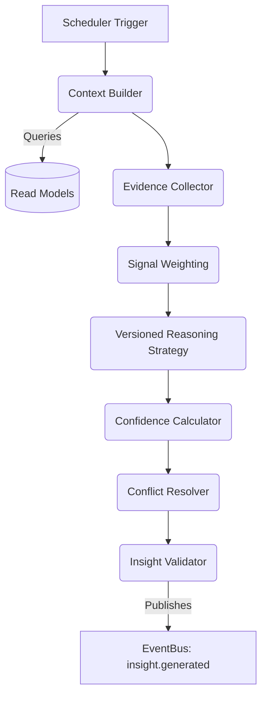

# Insight Engine Implementation Plan

**Module**: `src/engines/insight/`
**Owner**: Naren (Architecture Governance)
**Target Status**: Week 3/4 Milestone

---

## 1. Executive Summary

The **Insight Engine** is the apex reasoning layer of Cognis. While the Perception, Enrichment, and Response Intelligence engines react to immediate stimuli, the Insight Engine performs **longitudinal cognitive synthesis**. It does not listen to raw DOM events; instead, it observes broad system states, queries aggregated Read Models (via CQRS), and generates durable, evidence-backed knowledge (`insight.generated`, `automaticity.updated`).

This is the engine responsible for transforming scattered behavioral facts into a cohesive understanding of the user's cognitive trajectory.

## 2. System Architecture & Event Flow

### The Cognitive Reasoning Pipeline

To guarantee analytical rigor, the Insight Engine does not blindly map inputs to outputs. It executes a strict 8-stage pipeline:



1. **Context Builder**: Assembles a snapshot of the user's current State, Activation Profiles, and active session metrics.
2. **Evidence Collector**: Extracts required data from Projection Builders (e.g., Gap Profile histories, Response Analysis averages).
3. **Signal Weighting**: Applies recency decay and relevance weighting to collected evidence.
4. **Reasoning Strategy**: Executes domain-specific algorithms (e.g., `V1AutomaticityEvaluator`).
5. **Confidence Calculator**: Computes a strict confidence score based on the evidence volume.
6. **Conflict Resolver**: Checks if the new insight contradicts established identity baselines; downgrades confidence if conflicts arise without overwhelming evidence.
7. **Insight Validator**: Enforces schema constraints (taxonomy, minimum evidence).
8. **Publisher**: Emits the final `insight.generated` domain event.

## 3. The Insight Taxonomy

To ensure the engine knows *what* it is generating, every insight must strictly adhere to the following taxonomy:

| Taxonomy Domain | Description | Example Target Insight |
| :--- | :--- | :--- |
| **Behavioral** | General platform interaction patterns. | "User prefers keyboard navigation over mouse clicks." |
| **Learning** | Knowledge acquisition markers. | "User consistently queries definitions before application." |
| **Automaticity** | Skill mastery phase transitions. | "TypeScript syntax transition from Associative to Autonomous." |
| **Gap** | Cognitive load vulnerabilities. | "Working memory frequently overloaded in 3+ variable contexts." |
| **Prompting** | Prompt engineering habits. | "Consistently uses zero-shot prompting instead of few-shot." |
| **Writing & Reasoning**| Linguistic and logical structuring. | "Prefers deductive over inductive logical framing." |
| **Identity** | Core user preferences and traits. | "Prefers terse, bulleted responses over conversational tone." |

## 4. Confidence & Evidence Model

Insights cannot be one-off observations. The `Confidence Calculator` enforces the following mathematical model:

- **Minimum Evidence Count**: An insight requires at least $N$ independent events (e.g., 5 gap detections) before triggering.
- **Recency Decay**: Evidence older than 30 days is weighted at 50%. Evidence older than 90 days is weighted at 10%.
- **Base Confidence**: Calculated as `(Weighted Evidence / Threshold) * Strategy Baseline`.
- **Contradiction Penalty**: If the insight contradicts an existing Identity Read Model, confidence is slashed by 40% unless the new evidence volume exceeds the old evidence volume by 2x.
- **Threshold**: Only insights with `Confidence >= 0.75` are emitted.

## 5. Sub-Systems & Core Algorithms

### Identity Evolution
The Insight Engine is the sole mutator of the user's Identity. It queries the `IdentityProjection` (Read Model) to establish a baseline. When the reasoning pipeline generates a new `Identity` taxonomy insight (e.g., "User prefers visual diagrams"), it emits `insight.generated`. The **Identity Projection Builder** consumes this event and updates the Read Model, creating a closed-loop evolutionary system.

### Automaticity Algorithm (Skill Mastery)
The `AutomaticityEvaluator` strategy dictates when a user transitions between Cognitive → Associative → Autonomous phases.
- **Thresholds**: Evaluates speed (typing cadence), error rates (backspaces/gap detections), and reliance on Ghost Text.
- **Hysteresis**: Prevents "flickering" between phases. A transition requires a sustained 20% margin above the threshold for 3 consecutive sessions.
- **Regression**: If the user abstains from a skill for 60 days, or error rates spike, the phase regresses.
- **Recovery**: Regaining a lost phase requires only 50% of the original evidence volume (muscle memory simulation).
- **Plateau Detection**: If score variance remains `< 5%` for 10 sessions, a `milestone.reached` (Plateau) is emitted.

## 6. Engine Scheduler

The Insight Engine is expensive. It does not run per-event. It operates on a defined Scheduling Strategy triggered by:
- **`session.ended`**: Standard longitudinal evaluation.
- **Volume Thresholds**: Every 100 `prompt.sent` events.
- **Milestone Reached**: Evaluates cascading effects of a newly reached milestone.
- **Projection Changed**: Only critical threshold crossings from Projection Builders.
- **Scheduled Idle**: Background Service Worker idle timers (e.g., midnight cron).

## 7. Versioning & Migration Strategy

Cognitive algorithms will evolve. All reasoning algorithms implement a strict Strategy interface:
```typescript
export interface InsightStrategy {
    readonly version: string; // e.g. 'v1.2.0'
    readonly taxonomyDomains: ReadonlyArray<TaxonomyDomain>;
    execute(context: ReasoningContext): InsightCandidate[];
}
```
**Migration Philosophy:**
When `V2AutomaticityEvaluator` is introduced, `V1` remains in the codebase. Existing `automaticity.updated` events retain their `v1` metadata tag. New evaluations use `v2`. If the system requires a complete re-evaluation of history, a specialized "Knowledge Resynthesis" task can be dispatched, but live migrations prefer additive forward-progress over historical rewriting.

## 8. Definition of Done

- [ ] Core 8-stage Reasoning Pipeline implemented.
- [ ] Insight Taxonomy defined in `src/core/types/insight.types.ts`.
- [ ] Confidence Calculator implemented with recency decay and contradiction penalties.
- [ ] `V1AutomaticityEvaluator` implemented with Hysteresis and Plateau detection.
- [ ] Scheduler implemented, triggering on `session.ended`.
- [ ] Passes strict compilation (`tsc --noEmit`).

---
*Prepared by Cognis Architecture Governance.*
