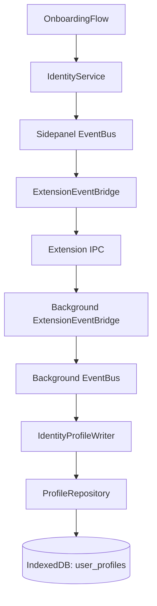

# Cognis Week 3 Onboarding and Identity Profile Implementation Plan

**Status:** IMPLEMENTED / VERIFIED
**Type:** Implementation Plan / Architectural Design Document

---

## 1. Executive Summary

This implementation establishes the foundational onboarding-to-profile pipeline.

The actual pipeline is:
`OnboardingFlow` -> `IdentityService` -> Sidepanel `EventBus` -> Sidepanel `ExtensionEventBridge` -> IPC -> Background `ExtensionEventBridge` -> Background `EventBus` -> `IdentityProfileWriter` -> `ProfileRepository` -> `user_profiles` IndexedDB store

The implementation introduces:
- `identity.onboarding.completed`
- `OnboardingCompletedPayload`
- `IdentityService`
- `ProfileRepository`
- `UserProfileRecord`
- `IdentityProfileWriter`
- `OnboardingFlow`
- Background wiring
- Sidepanel/Background bridge registration

This implementation does not define the final product semantics of the onboarding questions.

---

## 2. Architectural Principle

This architecture explicitly separates:
**A. Product semantics**
**B. Technical infrastructure**

The technical infrastructure is finalized. The product semantics for the three onboarding questions are not finalized. The infrastructure therefore treats the onboarding payload as an opaque typed payload after it leaves the UI/service boundary.

- UI knows the onboarding fields.
- `IdentityService` accepts the typed payload.
- `EventBus` does not interpret individual fields.
- `ExtensionEventBridge` does not interpret individual fields.
- `ProfileRepository` does not interpret individual onboarding fields.
- `IdentityProfileWriter` persists the payload without deriving semantic attributes.

---

## 3. Dependency / Data Flow Diagram



---

## 4. Event Contract

The exact implemented event is:
`identity.onboarding.completed`

The exact payload currently implemented:
```typescript
export interface OnboardingCompletedPayload {
  readonly answer1: string;
  readonly answer2: string;
  readonly answer3: string;
}
```

`answer1`, `answer2`, `answer3` are **TEMPORARY PLACEHOLDER FIELD NAMES**. They are not canonical Cognis domain vocabulary. Final semantic names remain a Product decision.

---

## 5. Temporary UI Contract

The currently implemented UI labels:
- Answer 1
- Answer 2
- Answer 3

These are temporary UI labels. They are implementation placeholders only.

The current UI uses HTML5 `required` validation. This is a Week 3 implementation default, NOT a finalized product requirement. Requiredness remains subject to future product specification.

---

## 6. Synthetic Session ID

```typescript
export const ONBOARDING_SESSION_ID = 'system-onboarding' as SessionId;
```

**Why it exists:**
The `DomainEvent` envelope structurally requires a `sessionId`. Onboarding is a system-level event and does not originate from an active cognitive task session. Therefore, `system-onboarding` is used as a structural compatibility identifier.

- It is not a real cognitive session.
- It must not be interpreted as a cognitive session.
- It is not a user identity.
- It is not a general-purpose identity namespace.
- It exists solely to satisfy the existing `DomainEvent` contract for onboarding events.

---

## 7. Identity Service

The implemented service boundary:
```typescript
export interface IdentityService {
  completeOnboarding(payload: OnboardingCompletedPayload): void;
}
```

The UI does not create `DomainEvent` envelopes. The `IdentityService` is responsible for:
- receiving the typed payload
- creating the `DomainEvent`
- supplying `ONBOARDING_SESSION_ID`
- supplying the event source (`sidepanel.onboarding`)
- publishing to the Sidepanel `EventBus`

---

## 8. Sidepanel UI Boundary

`src/sidepanel/features/onboarding/OnboardingFlow.tsx`

The component:
- owns three input states
- renders three inputs
- uses temporary labels
- uses HTML5 required validation
- constructs the typed payload
- calls `identityService.completeOnboarding()`
- does not access `EventBus` directly
- does not create `DomainEvent` objects
- does not access IndexedDB
- does not access `ProfileRepository`

The production render path:
`Root` -> `SidepanelRuntimeProvider` -> `App` -> `SidePanelLayout` -> `OnboardingFlow`

Exactly one production `OnboardingFlow` instance is rendered.

---

## 9. IPC / Event Bridge

`IdentityEvents` is included in the Sidepanel and Background bridge allowlists. The event value is `identity.onboarding.completed`.

The `ExtensionEventBridge` itself was not modified to understand onboarding semantics. It treats the event using the existing generic `DomainEvent` transport mechanism. The event envelope preserves the existing `DomainEvent` properties across the bridge, including:
- event id
- timestamp
- payload
- sessionId

This preserves the repository's existing origin and authoritative behavior without redefining it for onboarding.

---

## 10. Profile Persistence

- **Object store:** `user_profiles`
- **KeyPath:** `profileId`
- **Repository:** `src/storage/repositories/ProfileRepository.ts`

`ProfileRepository` is a pure IndexedDB storage adapter. It contains no:
- EventBus logic
- onboarding business logic
- product validation
- event subscription logic
- semantic interpretation of onboarding fields

**Methods:**
- `get(profileId)`
- `put(profileRecord)`
- `update(profileId, updater)`

`update()` performs the read-modify-write sequence inside a single IndexedDB `readwrite` transaction. This is the established Cognis atomic mutable-state pattern.

---

## 11. User Profile Record

The exact current schema:
```typescript
export interface UserProfileRecord {
  readonly profileId: string;
  readonly lastModified: number;
  readonly lastEventId?: string;
  readonly onboarding: OnboardingCompletedPayload;
}
```

- `profileId`: IndexedDB primary key.
- `lastModified`: Timestamp of the event that last successfully modified the profile.
- `lastEventId`: Identifier of the last event that successfully modified the profile. Used for exact duplicate detection.
- `onboarding`: Opaque typed onboarding payload.

`default-user` is currently used as the local singleton profile key. This is an implementation/storage convention. It is NOT a constitutional Cognis identity model.

---

## 12. Identity Profile Writer

`src/engines/identity/IdentityProfileWriter.ts`

It consumes `identity.onboarding.completed` and writes to `default-user`.

**Processing Rules:**
- **RULE 1: EXACT DUPLICATE**
  If `currentModel.lastEventId === event.id`, the event is ignored.
- **RULE 2: STALE EVENT**
  If `event.timestamp < currentModel.lastModified`, the event is ignored.
- **RULE 3: EQUAL TIMESTAMP, DISTINCT EVENT**
  If `event.id` differs and `event.timestamp === currentModel.lastModified`, the event is accepted. The resulting profile reflects whichever distinct event is processed last.
- **RULE 4: NEWER EVENT**
  If `event.timestamp > currentModel.lastModified`, the event is accepted.
- **RULE 5: LEGACY PROFILE**
  If an existing profile does not have `lastEventId`, it remains readable and processable. No database migration is required.

---

## 13. Concurrency Model

`ProfileRepository.update()` and `IdentityProfileWriter` together provide:
- atomic read-modify-write
- exact event ID deduplication
- stale-event protection
- equal-timestamp distinct-event acceptance
- protection against lost updates caused by concurrent IndexedDB writers

Atomicity is provided by the repository transaction. Event idempotency is provided by `lastEventId`. Stale-event ordering protection is provided by `lastModified`.

---

## 14. Background Composition

`src/background/index.ts`

The implementation creates and wires:
- CognisDatabase
- EventRepository
- ProfileRepository
- EventStoreSubscriber
- Projection infrastructure
- IdentityProfileWriter

`IdentityProfileWriter` is started exactly once in the Background composition root.

---

## 15. Mock Runtime

`src/runtime/mock/bootstrap.ts`

The mock runtime implements the same `IdentityService` contract:
```typescript
completeOnboarding(payload: OnboardingCompletedPayload): void
```
Its purpose is contract compatibility and runtime composition compatibility.

---

## 16. Migration Safety

No IndexedDB schema migration is required for changing `answer1`, `answer2`, `answer3` to future semantic field names.

**Reason:** The `user_profiles` object store schema is keyed by `profileId`. The onboarding payload is stored inside the application-level record. The storage infrastructure does not define the semantic meaning of `answer1`, `answer2`, or `answer3`. Future semantic naming is an application-level contract change rather than an IndexedDB object-store key/schema migration.

---

## 17. Deferred Product Decisions

The following are Product decisions, not infrastructure defects:
1. Final onboarding prompt 1 wording.
2. Final onboarding prompt 2 wording.
3. Final onboarding prompt 3 wording.
4. Canonical semantic field name for prompt 1.
5. Canonical semantic field name for prompt 2.
6. Canonical semantic field name for prompt 3.
7. Required versus optional status.
8. Empty-answer behavior.
9. Whitespace normalization.
10. Minimum answer length.
11. Maximum answer length.
12. Whether answers are stored verbatim.
13. Whether answers are transformed into derived profile attributes.
14. Intentional repeated onboarding behavior.
15. Re-onboarding overwrite, merge, or rejection policy.
16. Profile reset/deletion/replay semantics.

---

## 18. Re-Onboarding Semantics

Technical duplicate protection does NOT define product re-onboarding policy.

- **Technical duplicate:** The same DomainEvent ID is received more than once.
- **Product re-onboarding:** The user intentionally completes onboarding again and produces a new event.

The implementation safely handles technical duplicate and stale-event cases. The product has not yet defined whether intentional re-onboarding should overwrite, merge, reject, or create a new profile state.

---

## 19. File Change Matrix

| File | Responsibility |
|---|---|
| `docs/implementation-plans/week3-onboarding-implementation-plan.md` | Week 3 onboarding implementation plan |
| `docs/implementation-overviews/week3-onboarding-overview.md` | Week 3 onboarding implementation overview |
| `src/core/event-bus/contracts.ts` | Payload contract and synthetic session ID |
| `src/core/event-bus/registry.ts` | Identity event registration |
| `src/core/types/profile.types.ts` | User profile record |
| `src/engines/identity/IdentityProfileWriter.ts` | Background identity event consumer |
| `src/storage/repositories/ProfileRepository.ts` | IndexedDB profile persistence |
| `src/sidepanel/runtime/container.ts` | IdentityService contract |
| `src/sidepanel/runtime/bootstrap.ts` | Production IdentityService implementation |
| `src/runtime/mock/bootstrap.ts` | Mock IdentityService implementation |
| `src/sidepanel/features/onboarding/OnboardingFlow.tsx` | Onboarding UI |
| `src/sidepanel/app.tsx` | Production render registration |
| `src/background/index.ts` | Background composition and writer registration |

---

## 20. Invariants

- UI never directly publishes DomainEvents.
- UI never accesses IndexedDB.
- `IdentityService` owns event creation.
- `EventBus` remains generic.
- `ExtensionEventBridge` remains generic.
- `ProfileRepository` remains a storage adapter.
- `IdentityProfileWriter` remains the event-to-profile persistence boundary.
- Onboarding payload semantics do not leak into generic infrastructure.
- Exact duplicate events do not modify the profile.
- Older events do not overwrite newer profile state.
- Equal-timestamp distinct events are accepted.
- Profile updates occur atomically.
- Existing session projection infrastructure remains untouched.
- Onboarding uses a synthetic session ID only because the `DomainEvent` contract requires one.

---

## 21. Verification Plan

Verification steps actually performed:
- `npx tsc --noEmit` -> Expected result: **PASS**
- staged file scope verification
- mock runtime wiring
- live runtime wiring
- UI reachability
- EventBus registration
- Sidepanel bridge registration
- Background bridge registration
- profile repository transaction behavior
- IdentityProfileWriter duplicate/stale behavior
- conflict marker audit
- duplicate registration audit
- regression audit
- documentation consistency audit

There are currently no dedicated unit tests for: `EventBus`, `ExtensionEventBridge`, `IdentityProfileWriter`, `ProfileRepository`, `OnboardingFlow`.

---

## 22. Scope Exclusions

Week 3 does NOT implement:
- final onboarding product copy
- semantic onboarding domain vocabulary
- multi-user accounts
- user switching
- profile deletion UX
- profile reset UX
- profile replay
- derived identity attributes
- advanced validation
- normalization policy
- profile analytics
- onboarding completion read API
- finalized re-onboarding UX
