# Response Intelligence Engine Implementation Plan

**Module**: `src/engines/response/`
**Owner**: Naren (Architecture Governance)
**Target Status**: Week 3 Milestone

---

## 1. Executive Summary

The **Response Intelligence Engine** represents Cognis' analytical capability to observe, reconstruct, and comprehend the outputs generated by AI platforms (e.g., ChatGPT). Unlike the Enrichment Engine, which modifies outgoing prompts, the Response Intelligence Engine acts purely as an observer on incoming data streams. 

Crucially, **this engine does not generate insights.** Its sole responsibility is to analyze a *single* response in isolation. It reconstructs streaming response chunks, passes the complete text through a pipeline of deterministic, contract-driven analyzers (Structure, Reasoning, Completeness, Quality), and emits a standardized `response.analysis.completed` event. This event is subsequently persisted by the Event Store, projected into read models by Projection Builders, and ultimately synthesized across multiple sessions by the Insight Engine.

This separation of concerns preserves strict CQRS boundaries, ensuring that single-event processing is decoupled from longitudinal knowledge synthesis.

## 2. System Architecture & Module Boundaries

### Dependency Graph & Event Flow

```mermaid
sequenceDiagram
    participant Adapter as ChatGPT Adapter (Perception)
    participant Bus as EventBus
    participant Buffer as Response Reconstructor
    participant Pipeline as Analysis Pipeline
    participant Projections as Projection Builders
    participant DB as ReadModels DB
    participant Insight as Insight Engine

    Adapter->>Bus: response.started
    Bus->>Buffer: create(sessionId, promptHash)
    
    loop Streaming
        Adapter->>Bus: response.chunk(text)
        Bus->>Buffer: append(text)
    end
    
    Adapter->>Bus: response.completed(duration)
    Bus->>Buffer: seal()
    Buffer->>Pipeline: execute(fullText)
    
    rect rgb(30, 30, 40)
        Note right of Pipeline: Deterministic Analyzers
        Pipeline->>Pipeline: StructureAnalyzer
        Pipeline->>Pipeline: ReasoningAnalyzer
        Pipeline->>Pipeline: QualityAnalyzer
    end
    
    Pipeline->>Bus: response.analysis.completed(metrics)
    Buffer->>Buffer: destroy()
    
    Bus->>Projections: consume(response.analysis.completed)
    Projections->>DB: update(ResponseMetricsProfile)
    
    Note over DB,Insight: Insight Engine synthesizes knowledge later
```



### Module Boundaries
- **Inbound Interfaces**: Strictly bound to `ResponseEvents` from `src/core/event-bus/registry.ts`.
- **Outbound Interfaces**: Emits purely factual, derived metadata (`response.analysis.completed`).
- **Isolation**: Zero dependency on `document`, `window`, or network interception libraries. The Perception layer is fully responsible for extracting the stream.

## 3. Analyzer Contracts & Deterministic Pipeline

To ensure the engine is rigorous, testable, and deterministic, all analysis is performed by isolated modules conforming to a strict `ResponseAnalyzer` contract.

### The Analyzer Contract
```typescript
export interface AnalysisResult {
  readonly score: number; // 0.0 to 1.0
  readonly flags: ReadonlyArray<string>;
  readonly metadata: Record<string, number | string>;
}

export interface ResponseAnalyzer {
  readonly version: string;
  readonly analyzerName: string;
  readonly latencyBudgetMs: number;
  
  /**
   * Pure, deterministic function evaluating a response string.
   */
  analyze(responseText: string, promptHash: string): AnalysisResult;
}
```

### Concrete Analyzers

#### 1. Structure Analyzer
- **Purpose**: Evaluates the formatting and physical composition of the response.
- **Algorithm**: Regex and AST-based parsing of Markdown boundaries.
- **Metrics Computed**:
  - `codeBlockCount`: Number of ` ``` ` blocks.
  - `markdownBalance`: Ratio of structural formatting (lists, headers) to plain text.
  - `listDensity`: Percentage of response contained in `<ul>`/`<ol>`.
- **Emitted Metrics**: Structure Score (0.0-1.0), Flags (`heavy_code`, `prose_heavy`).

#### 2. Reasoning Analyzer
- **Purpose**: Evaluates the logical depth and explanatory density of the response.
- **Algorithm**: Keyword heuristic matching and linguistic transition counting.
- **Metrics Computed**:
  - `chainLength`: Count of sequential reasoning markers ("firstly", "therefore", "because").
  - `branching`: Count of conditional markers ("if", "alternatively", "however").
  - `explanationDensity`: Ratio of explanatory text to imperative/code text.
- **Emitted Metrics**: Reasoning Score (0.0-1.0), Flags (`step_by_step`, `shallow_directive`).

#### 3. Completeness Analyzer
- **Purpose**: Evaluates if the response abruptly terminates or lacks conclusion.
- **Algorithm**: End-of-string structural checks.
- **Metrics Computed**:
  - `terminationState`: Boolean detecting trailing unclosed markdown tags.
  - `conclusionMarkers`: Presence of concluding phrases ("In summary", "Let me know").

#### 4. Quality Analyzer (Heuristic)
- **Purpose**: A composite score blending structure and reasoning to grade overall interaction quality.
- **Algorithm**: Weighted average of Sub-Analyzers.
- **Emitted Metrics**: Quality Score (0.0-1.0).

## 4. Reconstructor Buffer Architecture (ADR-019 Compliant)

To analyze reasoning, the engine *must* reconstruct the text transiently. Per **ADR-019: Transient Transport Data Policy**, the `ResponseChunkPayload` includes `chunkText` as a strict transport-only field.

**Buffer Specifications:**
- **Maximum Buffer Size**: 500KB per session (approx. 100,000 words). If exceeded, the buffer truncates, flags `oversize_abandoned`, and halts.
- **Concurrent Sessions**: Keyed by `sessionId`. Multiple AI tabs are supported independently.
- **Timeouts & Cleanup**: An internal watchdog timer fires if no `response.chunk` is received for 60 seconds. The buffer is marked `timeout_abandoned` and destroyed.
- **Browser Refresh / SW Restart**: Buffers are strictly in-memory. If the Service Worker restarts mid-stream, the buffer is lost. The engine will ignore `response.completed` if no buffer exists for the session (fail-safe).
- **Privacy Enforcement (ADR-019)**: The buffer is forcibly dereferenced and garbage collected the millisecond `response.analysis.completed` is published. The text is never persisted or transmitted.

## 5. Replay Modes & Engine Behavior

Cognis supports three distinct replay scenarios. The Response Intelligence Engine's behavior varies per mode:

1. **Live Mode (Normal Operation)**:
   - Engine is **ACTIVE**.
   - Subscribes to `ResponseEvents`. Buffers chunks. Executes Analyzers. Publishes `response.analysis.completed`.
2. **Projection Rebuild Mode (CQRS Resync)**:
   - System drops IndexedDB `read_models` and replays all events from `EventRepository` to rebuild projections.
   - Engine is **DISABLED**. Engines only generate *new* facts. Generating `response.analysis.completed` during a projection rebuild would pollute the event store with duplicates.
3. **Event Replay Mode (Algorithm Upgrade)**:
   - A rare mode where V2 of the Response Intelligence Engine runs against historical `response.completed` events (if we stored raw text, which we don't). 
   - Because Cognis is privacy-first (no raw text stored), **historical Event Replay for Response Intelligence is impossible by design.** We can only rebuild projections using the existing `response.analysis.completed` facts generated at the time of the original response.

## 6. Directory Structure

```text
src/engines/response/
├── ResponseIntelligenceEngine.ts     # Main orchestrator & EventBus subscriber
├── ReconstructorBuffer.ts            # Transient memory manager (Timeout/GC)
├── interfaces.ts                     # Analysis contracts (ResponseAnalyzer)
├── pipeline/                         # Orchestrates sequential analyzers
│   └── AnalysisPipeline.ts
├── analyzers/                        # Pure function heuristics
│   ├── StructureAnalyzer.ts
│   ├── ReasoningAnalyzer.ts
│   ├── CompletenessAnalyzer.ts
│   └── QualityAnalyzer.ts
└── index.ts                          # Public exports
```

## 7. Definition of Done

- [ ] ADR-019 approved and merged (Transient Buffer rules & Payload updates).
- [ ] `ResponseAnalyzer` contract defined.
- [ ] 4 concrete analyzers implemented with pure deterministic functions.
- [ ] `ReconstructorBuffer` implemented with 60s watchdog and 500KB thresholds.
- [ ] New event payload `ResponseAnalysisCompletedPayload` added to Contracts.
- [ ] Engine successfully reconstructs a mocked stream and emits analysis.
- [ ] Passes strict compilation (`tsc --noEmit`).

## 8. Architectural Risks & Constitutional Compliance

| Risk/Constraint | Mitigation | Compliance Status |
| :--- | :--- | :--- |
| **Section 2: Privacy** (No raw text persistence) | Analyzers process text transiently in-memory. Only hashes/metrics are emitted to the EventBus. | ✅ Compliant |
| **Risk: Memory Leaks** | Buffers use explicit `destroy()` routines and watchdog timeouts to guarantee garbage collection. | ✅ Mitigated |
| **Risk: Chunk payload lacking text** | ADR-019 Transient Transport Data Policy approved. Storage layer drops `chunkText` during persistence mapping. | ✅ Mitigated via ADR-019 |

---
*Prepared by Cognis Architecture Governance.*
