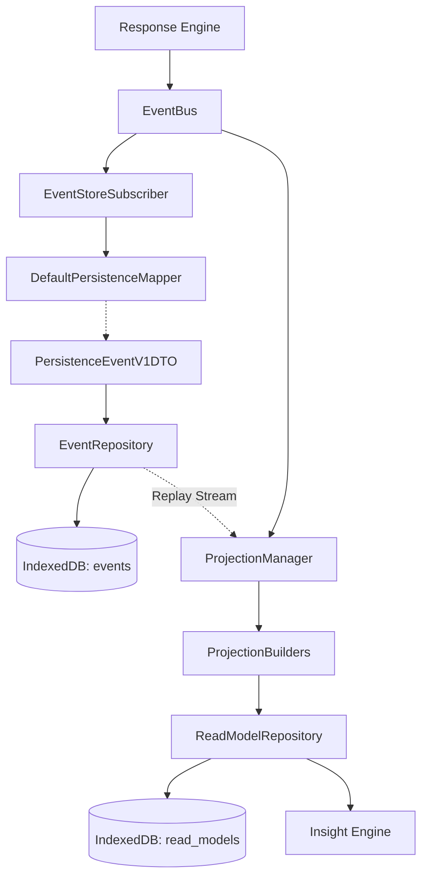
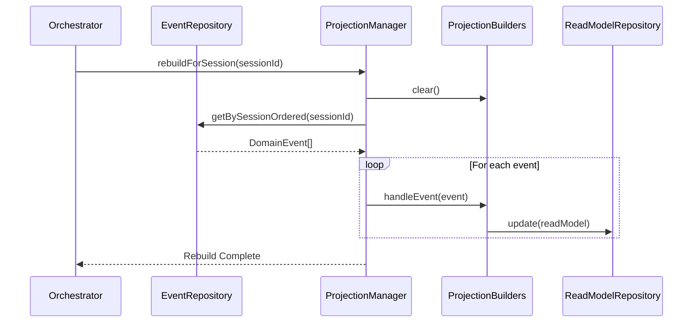

# RFC: Cognis Storage Hardening & Projections Implementation Plan (Final)

**Author:** Cognis Architecture Lead  
**Status:** APPROVED  
**Type:** Implementation Plan / Architectural Design Document  

---

## 1. Executive Summary

As Cognis scales to accommodate deeper cognitive workflows, our underlying storage subsystem requires significant architectural hardening. We must formalize the **Transient Transport Data Policy (ADR-019)**, capture sophisticated metric events (`response.analysis.completed`), and introduce deterministic read models.

This RFC outlines a 5-module implementation plan to build a robust, failure-resistant, CQRS-compliant storage pipeline. It introduces a versioned `DefaultPersistenceMapper`, strict immutability boundaries mapped to a generic `PersistenceEventV1DTO`, a `ResponseMetricsProjectionBuilder`, and a hardened, non-destructive failure recovery strategy.

## 2. Dependency Architecture



---

## 3. Module Breakdown

### Module 1: ADR-019 Integration & DefaultPersistenceMapper
**Objective:** Formally define the boundary where in-memory transport data is stripped before entering the persistent store.

* **Architecture:** Sanitization is a persistence concern. We introduce `DefaultPersistenceMapper` (versioned to allow future evolutions) which maps a pure `DomainEvent` into a sanitized `PersistenceEventV1DTO`.
* **Generic Transport Policies:** Instead of hardcoding `chunkText`, the mapper uses a strongly-typed, event-specific policy table (`transportOnlyFields`) to support future ephemeral data.
* **Pure Transformation:** We strictly use functional data transformations to map from `DomainEvent` to `PersistenceEventV1DTO`. No `Object.assign` or `delete` mutations are permitted.

```typescript
export interface PersistenceEventV1DTO extends Omit<DomainEvent<any>, 'payload'> {
  readonly payload: Record<string, unknown>;
}

type TransportPolicyMap = {
  [K in EventType]?: ReadonlyArray<keyof Extract<DomainEvent<any>, { type: K }>['payload']>;
};

export class DefaultPersistenceMapper {
  private readonly transportOnlyFields: TransportPolicyMap = {
    [ResponseEvents.CHUNK]: ['chunkText']
  };

  public sanitize(event: DomainEvent<any>): PersistenceEventV1DTO {
    const fieldsToRemove = this.transportOnlyFields[event.type];
    
    if (!fieldsToRemove || fieldsToRemove.length === 0) {
      return event as PersistenceEventV1DTO;
    }

    // Pure functional omission
    const sanitizedPayload = Object.fromEntries(
      Object.entries(event.payload).filter(([key]) => !fieldsToRemove.includes(key))
    );

    return { ...event, payload: sanitizedPayload };
  }
}
```

### Module 2: Persistence Support for Response Analysis
**Objective:** Expand schemas to support `response.analysis.completed` events.

* **Architecture:** The IndexedDB generic `events` store natively supports these.
* **Serialization Guarantees:** Ensure `ResponseAnalysisCompletedPayload` serializes consistently (preserving float scores and flag arrays) via the Structured Clone Algorithm.

### Module 3: ResponseMetricsProjectionBuilder
**Objective:** Aggregate response metrics into a longitudinal read model.

* **Architecture:** A deterministic projection builder computing sums instead of averages to bypass floating-point drift.
* **Idempotency & Deduplication:** The builder relies entirely on the `EventBus` (live) and `ProjectionManager` (replay) orchestration for a monotonic stream. It acts as a pure projection mechanism.
* **Read Model Schema:**
  ```typescript
  export interface ResponseMetricsReadModel {
    readonly projectionId: string;
    readonly sessionId: string;
    readonly totalResponses: number;
    readonly qualitySum: number;
    readonly reasoningSum: number;
    readonly structureSum: number;
    readonly flagsFrequency: Record<string, number>;
    readonly lastUpdated: number;
  }
  ```

### Module 4: ReadModelRepository Integration
**Objective:** Expose projections to the frontend and Insight Engine.

* **API Additions:** Expose `getAllResponseMetrics()` primitive. Aggregation happens purely in the Insight domain layer.
* **Concurrency:** Use a single IndexedDB `readwrite` transaction encapsulating the entire read-modify-write sequence (`update<T>`) to prevent lost updates during concurrent analysis events.

### Module 5: Storage Hardening & Resiliency
**Objective:** Fortify IndexedDB against extension environment constraints without compromising the integrity of the Event Store.

* **Failure Mode 1: QuotaExceededError**
  - *Policy:* The Event Store is the ultimate source of truth. Automatic deletion is strictly prohibited.
  - *Mitigation:* Halt persistence, surface a critical telemetry error to the user, and prompt for manual cleanup. No events are automatically evacuated.
* **Failure Mode 2: VersionChange & DB Lifecycles**
  - Monitor and gracefully handle `onblocked`, `onversionchange`, `onclose`, `onabort`, transaction aborts, and database deletion to prevent concurrent tab deadlocks.

---

## 4. Observability & Storage Metrics

To guarantee operational excellence over time, we will instrument the storage layer to capture:
- **Append Latency:** Time to persist an event to IndexedDB.
- **Projection Latency:** Time for a builder to process an event.
- **Sanitization Duration:** Overhead introduced by `DefaultPersistenceMapper`.
- **Database Open Time:** Latency in `CognisDatabase.open()`.
- **Replay Duration:** Total time to rebuild read models.
- **Replay Throughput:** Events processed per second during rebuilds.
- **Projection Failures:** Count of handled exceptions inside builders.
- **Projection Rebuild Count:** Frequency of manual or triggered rebuilds.
- **Database Size:** Current byte size (estimated via quota API).
- **Read Model Count:** Total materialized records.

---

## 5. Replay Sequence Diagram


