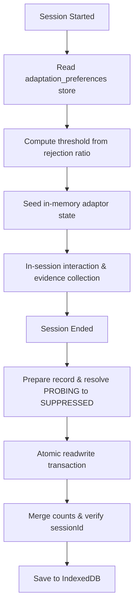

# Milestone 10: Persistent User Model

## Overview
Milestone 10 establishes a cross-session user model for Cognis. By implementing a persistent storage schema in IndexedDB, the adaptation loop can persist cumulative behavioral evidence (exposures, acceptances, and explicit rejections) and reconstruct the user's preference state when starting a new session. This eliminates session-start amnesia without violating data minimization or storing volatile policy decisions.

---

## Objectives & P0/P1 Correctness Items

### Persistence & Storage Isolation
* **Store Isolation**: Created a dedicated `adaptation_preferences` object store in IndexedDB (schema version 4), keeping it separate from user onboarding profile data.
* **Separation of Evidence and Policy**: Persisted only cumulative counts (exposures, acceptances, explicit rejections) and the resolved preference state. Derived policy states (like probe counters and thresholds) are dynamically reconstructed.
* **PROBING Resolution Guard**: A session ending in the `PROBING` state is flushed to storage as `SUPPRESSED`, preventing unresolved probes from leaking across sessions.

### Concurrent Write & Sync Safety
* **Atomic Read-Merge-Write**: Designed the database flush to run inside a single atomic transaction, preventing lost updates from concurrent writes.
* **Idempotency**: Prevented double-writes of the same session evidence using a session-based identifier.
* **Service Worker Resilience**: Gracefully handles cold starts by rehydrating the adaptation engine on session starting events.

---

## Architecture Flow

---

## Verification Summary

* **Unit Testing**: Verified via `GhostTextAdaptor.persistent.selftest.ts` which simulates sequential session lifecycles, proving that:
  - Evidence from session 1 correctly suppresses the target module.
  - Session 2 starts immediately in the suppressed state and derives the correct probe threshold from past rejection history.
  - Session 2 probe acceptance successfully reverses the persistent preference state back to active.
* **Schema Integrity**: Executed `npm run test` validating that all JSON schemas and SVGs remain correct.
* **Compiler Check**: Verified complete type safety via `npx tsc --noEmit`.

---

## Conclusion
**Status: ✅ COMPLETE & VERIFIED**

Milestone 10 successfully validates that Cognis can securely remember user behavioral evidence across sessions and correctly adapt in subsequent sessions, completing the persistent feedback loop.
