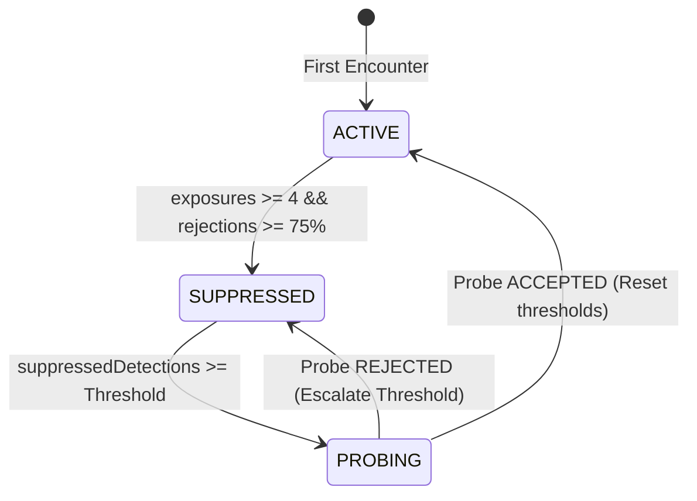

# Milestone 9: Reversible Evidence-Based Adaptation

## Overview
Milestone 9 transitioned the Cognis inline intervention loop into a stateful, reversible adaptation cycle. We implemented a background state machine that actively explores user preferences rather than applying permanent suppression. By utilizing strict probe attribution, Cognis can verify whether a user's preference has changed within a session, demonstrating a scientifically traceable feedback loop.

---

## Objectives & P0/P1 Correctness Items

### Reversible Adaptations
* **PreferenceState**: Modeled as `ACTIVE | SUPPRESSED | PROBING`, initialized lazily per `GapType`.
* **Exploration Policy**: Automatically tick exploration on passive detections (`gap.detected`) when suppressed. Trigger a probe trial when threshold is met.
* **Strict Probe Attribution**: Require the subsequent `ACCEPTED` or `DISMISSED` event to match the probe's specific `interventionId` to transition state.
* **Non-Fabrication Guardrails**: Passive events during probes do not count as positive or negative evidence; they reset the probe target and maintain exploration status.
* **Escalation**: Double exploration intervals when a probe is rejected to reduce disruption.

---

## Implementation Details

### Reversible State Machine

1. **ACTIVE**: Evaluates explicit rejections (`continued_typing` | `caret_moved`) over total exposures.
2. **SUPPRESSED**: Generation is disabled. Every `gap.detected` increments `suppressedDetections` to pace exploration.
3. **PROBING**: Emits `'active'` configuration, locks onto the first displayed `interventionId`. If accepted, transitions to `ACTIVE`. If rejected, transitions back to `SUPPRESSED` and doubles the threshold.

---

## Conclusion
**Status: ✅ COMPLETE & VERIFIED**

Milestone 9 successfully validated that inline intervention preferences can be dynamically reversed using strict probe-to-outcome attribution, maintaining the policy boundaries within `GhostTextAdaptor`.
